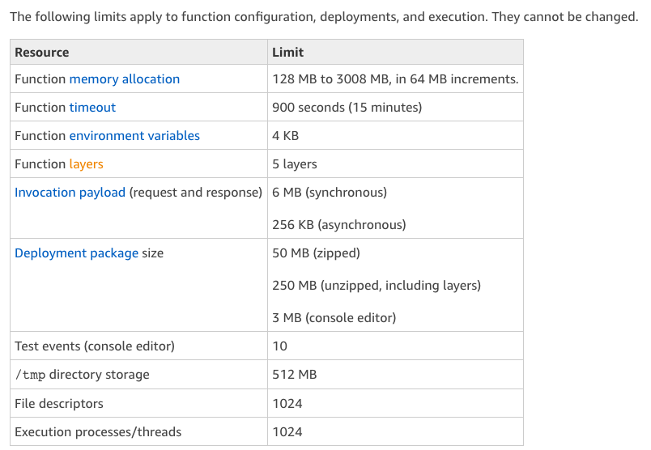

<!--
title: 'Running Puppeteer on AWS Lambda'
description: 'This example shows you how to run Puppeteer on AWS Lambda'
framework: v4
platform: AWS
language: nodeJS
priority: 10
authorLink: 'https://github.com/emaildano'
authorName: 'Daniel Olson'
authorAvatar: 'https://avatars3.githubusercontent.com/u/1872327?v=4&s=140'
-->

### Running Puppeteer on AWS Lambda Using Serverless Framework

### Instructions to run locally

```
$ npm install
$ sls offline
```

### To Deploy on AWS

- Select your AWS profile (e.g. `export AWS_PROFILE=<your aws profile>` or `--aws-profile <your aws profile>`) and run

```
$ sls deploy
```
___________
# About Project

When it comes to AWS Lambda function , they have their own limits as follows

So , When you try to use Puppeteer your deployment package size(unzipped)  easily go's above 250 mb because When you install Puppeteer, it downloads a recent version of Chromium (~170MB Mac, ~282MB Linux, ~280MB Win) that is guaranteed to work with the API.

## Solution

This example uses [`puppeteer-core`](https://www.npmjs.com/package/puppeteer-core) (no bundled Chromium) together with [`@sparticuz/chromium`](https://www.npmjs.com/package/@sparticuz/chromium), a Brotli-compressed Chromium build made for Lambda.

> **Architecture note:** `@sparticuz/chromium` only ships **x86_64** Chromium binaries (no arm64 build), so this is the one example in this repo pinned to `architecture: x86_64` instead of the usual `arm64` default. Keep the `@sparticuz/chromium` major version aligned with whatever Chromium version your `puppeteer-core` version expects — see the [Puppeteer Chromium Support page](https://pptr.dev/chromium-support).

# How ??

## 1. Install the dependencies

```
$ npm i puppeteer-core @sparticuz/chromium
```

## 2. Use `chromium.executablePath()` in your handler

```js
/* handler.js */
import chromium from '@sparticuz/chromium';
import puppeteer from 'puppeteer-core';

export const hello = async (event) => {
  const { url } = event.queryStringParameters;
  const browser = await puppeteer.launch({
    args: chromium.args,
    defaultViewport: chromium.defaultViewport,
    executablePath: await chromium.executablePath(),
    headless: chromium.headless,
  });
  const page = await browser.newPage();
  await page.goto(url, { waitUntil: 'networkidle0' });
  const content = await page.evaluate(() => document.body.innerHTML);
  await browser.close();
  return {
    statusCode: 200,
    body: JSON.stringify({ content }),
  };
};
```

That's all, you can now use Puppeteer on AWS Lambda.

### To Test It Locally

```
  $ npm i serverless-offline
```

- Make the following request (replace `{{URL}}` with the page you want to get content for)

```
curl -X GET \
  'http://localhost:3000?url={{URL}}' \
```

### To Deploy on AWS

```
  $  sls deploy
```

- Make the following request (replace `{{URL}}` with the page you want to get content for and `{{lambda_url}}` with your lambda url)

```
curl -X GET \
  '{{lambda_url}}?url={{URL}}' \
```
