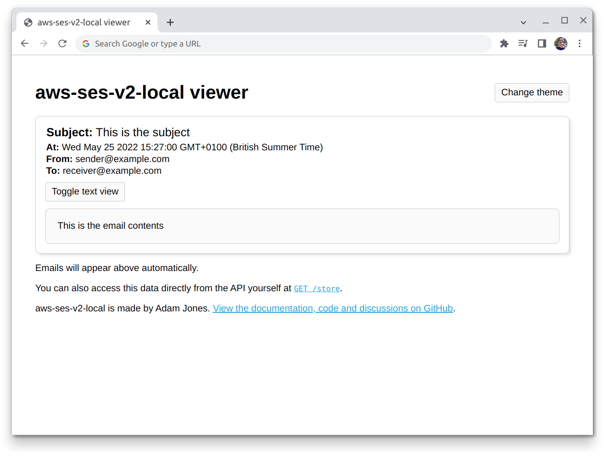

# AWS SES for sending emails with offline support

Sending emails on a schedule with AWS EventBridge, AWS Lambda, AWS SES with offline support

## How it works

[`serverless.yml`](./serverless.yml) defines a `sendEmail` AWS Lambda function that is invoked every minute (using EventBridge under the hood). It also states that when it is invoked it should call the `main` function in [`handler(.js)`](./handler.js). There's also some basic IAM statements that grant the function permission to send emails via SES. The handler itself uses the AWS SES V2 SDK to send a fairly basic email when it is invoked.

To get it working locally, we add the [`serverless-offline`](https://github.com/dherault/serverless-offline) and [`serverless-offline-ses-v2`](https://github.com/domdomegg/serverless-offline-ses-v2) plugins to [`serverless.yml`](./serverless.yml). This allows us to simulate the parts of AWS we need locally. When we call `npm start`, this runs the `start` script in [`package.json`](./package.json) that starts up the plugins. `serverless-offline` automatically sets the [`IS_OFFLINE`](https://github.com/dherault/serverless-offline/#the-processenvis_offline-variable) environment variable so we know to set up the AWS SES V2 SDK to point at `serverless-offline-ses-v2`.

We can see the results of the function locally by opening up the viewer that `aws-ses-v2-local` starts up for us (which is managed by the `serverless-offline-ses-v2` plugin):



## Setup

```
npm install
```

## Running locally

```
npm start
```

By default, the function will be invoked every minute. If you want to invoke it manually and have the AWS CLI installed, you can open another terminal and run:

```
aws lambda invoke /dev/null \
  --endpoint-url http://localhost:3002 \
  --function-name aws-node-ses-send-email-and-offline-dev-sendEmail
```

More details on manually invoking Lambda functions locally can be found in [the `serverless-offline` documentation](https://github.com/dherault/serverless-offline/#usage-with-invoke).

## Deploying to AWS

```
serverless deploy
```
