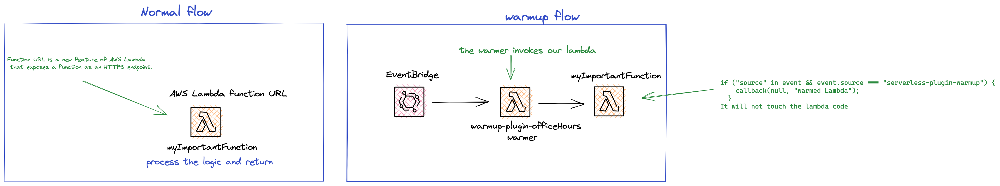

<!--
title: 'AWS Node Typescript Warmup Lambda Example'
description: 'The following simple example shows how to solve the cold start problem of AWS lambda functions, through keeping function warm using Serverless WarmUp Plugin.'
layout: Doc
framework: v3
platform: AWS
language: nodeJS
authorLink: 'https://github.com/pigius'
authorName: 'Daniel Aniszkiewicz'
authorAvatar: 'https://avatars1.githubusercontent.com/u/8863200?s=200&v=4'
-->

# AWS Node Typescript Warmup Lambda

The following simple example shows how to solve the [cold start](https://aws.amazon.com/blogs/compute/operating-lambda-performance-optimization-part-1/) problem of AWS lambda functions, through keeping function warm using[ Serverless WarmUp Plugin](https://github.com/juanjoDiaz/serverless-plugin-warmup).

## Preface

A cold start happens when you execute an inactive function. AWS can drop the container after a period of inactivity. In theory AWS needs a ready supply of containers to spin up when functions are invoked. That means that functions are kept warm for a limited amount of time (usually 30 – 45 minutes).

In a project this can often occur for workloads that are not in production and have irregular traffic, e.g. for different environments (`demo`, `staging`, `test`) or for different schedulers, or according to working hours (office hours, out of office hours).

Let's say we have a `myImportantFunction`, which non-regularly during typical business hours, does something important for us, and we would like it to be active all the time, and we wouldn't want cold starts.

## Diagram



This project, shows how to easily use a plugin https://github.com/juanjoDiaz/serverless-plugin-warmup that pings our function every specified time (45 minutes) between 7AM and 6PM from Monday to Friday, for warmup, so the cron expression will be `"cron(0/45 7-18 ? * MON-FRI *)"`

```js
if ("source" in event && event.source === "serverless-plugin-warmup") {
  callback(null, "warmed Lambda");
}
```

Inside our handler, we check the content of the `source` of the `event`. If it contains the value `serverless-plugin-warmup`, we know that this is a trigger from a plugin that does a warmup of our lambda, so we can return a callback (we don't want to touch the code of our lambda, just do a warmup of the lambda).

With normal invocations, this condition will be bypassed, and our lambda code will be touched.

The plugin itself has a lot of options, be it for automatically heating all lambda functions as well as other useful things.

There are some issues of using this plugin with typescript, but the solutions used in this example allow for seamless use. If you want to know more - check out the [typescript issue](https://github.com/serverless/serverless-plugin-typescript/issues/125).

Be advised, that you need to add:

`"allowJs": true`

to `tsconfig.json` as the plugin will add `_warmUpPluginWARMER-NAME-HERE.js`.

## Setup

`npm install` to install all needed packages.

## Deployment

In order to deploy the service run:

```bash
sls deploy
```

for deploying with a specific `profile` (located in `~/.aws/credentials`) you can simply use the command:

```bash
AWS_PROFILE=YOUR_PROFILE_NAME sls deploy
```

for deploying to the specific stage, let's say `staging` do:

```bash
sls deploy --stage staging
```

The expected result should be similar to:

```bash
➜ AWS_PROFILE=personal sls deploy
Running "serverless" from node_modules

Deploying aws-node-typescript-warmup to stage dev (eu-central-1)
WarmUp: Creating warmer "officeHours" to warm up 1 function
Compiling with Typescript...
Typescript compiled.

✔ Service deployed to stack aws-node-typescript-warmup-dev (83s)

endpoint: https://XXXXXXXXXXXXXXXX.lambda-url.REGION.on.aws/
functions:
  myImportantFunction: aws-node-typescript-warmup-dev-myImportantFunction (5.8 kB)
  warmUpPluginOfficeHours: aws-node-typescript-warmup-dev-warmup-plugin-officeHours (3.5 kB)
```

As you can see, during the deployment you will be informed, how many lambda functions will be warmed.

## Usage

Invoke the endpoint from the output of the deployment, either via curl, or postman to trigger lambda as usual. The warmup will be automatically triggered by a plugin, so you don't need to do anything extra.

## Log retention

The log retention is setup for 30 days. To change it simply change the value of this attribute in `serverless.yml` file:

```bash
logRetentionInDays: 30
```

## Advanced configuration

More options (memory, concurrency etc. ), could be found in the plugin [repository](https://github.com/juanjoDiaz/serverless-plugin-warmup).

## Structure

| Path                                 | Explanation               |
| ------------------------------------ | ------------------------- |
| `./src`                              | All code for the project. |
| `./src/handlers/myImportantFunction` | Handler for lambda.       |

## Serverless plugins

For this example, there are two serverless plugins used:

| Plugin                                                                                                       | Explanation                                                                                                                  |
| ------------------------------------------------------------------------------------------------------------ | ---------------------------------------------------------------------------------------------------------------------------- |
| [serverless-plugin-typescript](https://www.npmjs.com/package/serverless-plugin-typescript)                   | Typescript support.                                                                                                          |
| [serverless-plugin-warmup](https://www.npmjs.com/package/serverless-plugin-warmup)                           | Plugin for the warmup                                                                                                        |
| [serverless-plugin-warmup-ts-bridge-v2](https://www.npmjs.com/package/serverless-plugin-warmup-ts-bridge-v2) | The library resolves a warmup and [typescript issue](https://github.com/serverless/serverless-plugin-typescript/issues/125). |
|                                                                                                              |

## Costs estimation

The calculation will not be 1:1 to reality, AWS pricing is very tricky, and we can't take everything into account.

Lambda Memory which we use for our functions = 1024MB
Lambda Duration Cost for 1024MB Memory = 0.0000000167 USD per **ms**

Single lambda warmup takes about 100ms but assume it will take 1 second to accomplish for optimistic and 5 seconds for the pessimistic (warmer lambda)

Lambda Duration Cost for 1024MB Memory = 0.0000167 USD per **second**

Ping Interval = Every 45 Minutes 7-18 Mon - Friday

**Points in time: per day: 14 (starting 7:00 ending 17:45)**

7:00:00 7:45:00 8:30:00 9:15:00 10:00:00 10:45:00 11:30:00 12:15:00 13:00:00 14:45:00 15:30:00 16:15:00 17:00:00 17:45:00

**Optimistic:**

Cost per day = 14 ping = 14\*0.0000167 USD = 0.0002338 USD

Cost per year only working days (260 working days in 2022) =260\*0.0002338 USD = 0.060788 USD

**Pessimistic:**

Cost per day = 14 ping = 14* (5* 0.0000167 USD) = 0.001169 USD

Cost per year only working days (260 working days in 2022) =260 \* 0.001169 USD = 0.30394 USD

## Remove service

To remove the service do:

```bash
sls remove
```

And the stack will be removed from the AWS.
