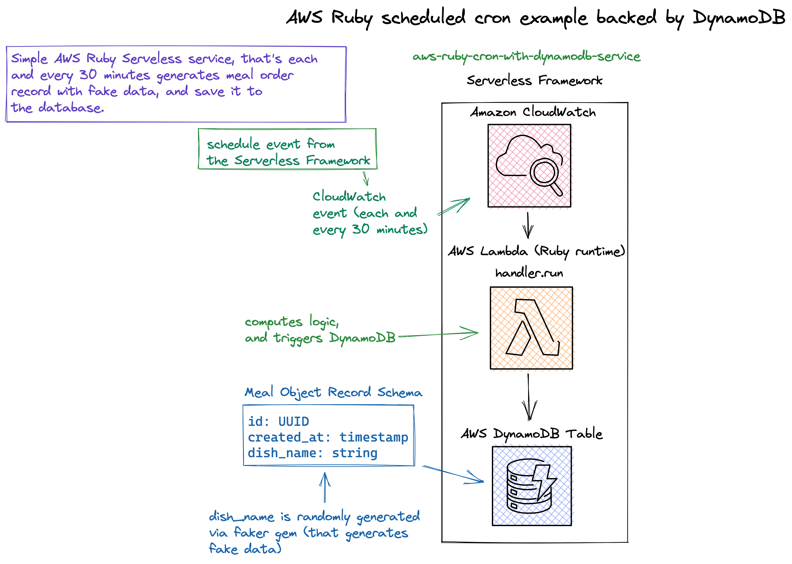
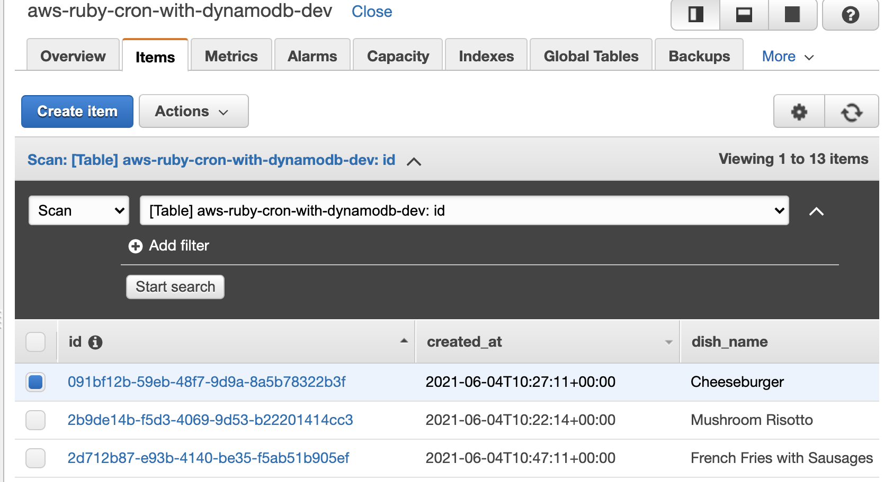
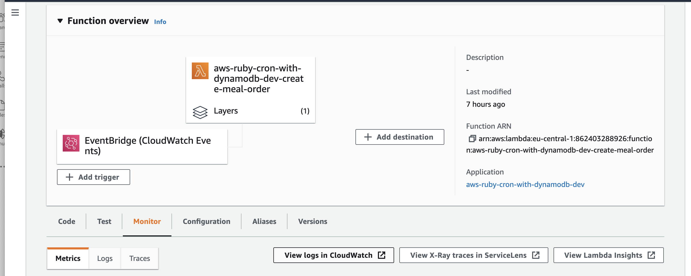
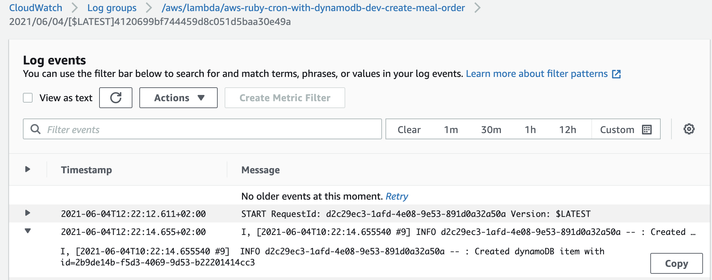

<!--
title: 'AWS Ruby scheduled cron example backed by DynamoDB'
description: 'This is an example of creating a function that runs as a cron job using the serverless schedule event. With the usage of the AWS Lambda function, it creates a record to the DynamoDB each and every 30 minutes.'
layout: Doc
framework: v2
platform: AWS
language: Ruby
priority: 10
authorLink: 'https://github.com/pigius'
authorName: 'Daniel Aniszkiewicz'
authorAvatar: 'https://avatars1.githubusercontent.com/u/8863200?s=200&v=4'
-->
# AWS Ruby scheduled cron example backed by DynamoDB

This is an example of creating a function that runs as a cron job using the serverless `schedule` event. With the usage of the `AWS Lambda` function, it creates a record to the `DynamoDB` each and every 30 minutes. For more information on the `schedule` event check out the Serverless docs on [schedule](https://serverless.com/framework/docs/providers/aws/events/schedule/).


## Diagram



## Setup

`npm install` to install all needed packages.

## Deployment

In order to deploy the service run:

```bash
sls deploy
```

for deploying with a specific `profile` (located in `~/.aws/credentials`) you can simply use the command:

```bash
AWS_PROFILE=YOUR_PROFILE_NAME sls deploy
```

for deploying to the specific stage, let's say `staging` do:

```bash
sls deploy --stage staging
```

The expected result should be similar to:

```bash
Serverless: Packaging service...
Serverless: Excluding development dependencies...
Serverless: Clearing previous build ruby layer build
[ '2.1' ]
Serverless: Installing gem using local bundler
Serverless: Zipping the gemfiles to aws-ruby-cron-with-dynamodb/.serverless/ruby_layer/gemLayer.zip
Serverless: Configuring Layer and GEM_PATH to the functions
Serverless: Creating Stack...
Serverless: Checking Stack create progress...
........
Serverless: Stack create finished...
Serverless: Uploading CloudFormation file to S3...
Serverless: Uploading artifacts...
Serverless: Uploading service aws-ruby-cron-with-dynamodb.zip file to S3 (1.45 KB)...
Serverless: Uploading service gemLayer.zip file to S3 (2.64 MB)...
Serverless: Validating template...
Serverless: Updating Stack...
Serverless: Checking Stack update progress...
...........................
Serverless: Stack update finished...
Service Information
service: aws-ruby-cron-with-dynamodb
stage: dev
region: us-east-1
stack: aws-ruby-cron-with-dynamodb-dev
resources: 10
api keys:
  None
endpoints:
  None
functions:
  create-meal-order: aws-ruby-cron-with-dynamodb-dev-create-meal-order
layers:
  gem: arn:aws:lambda:us-east-1:862403288926:layer:aws-ruby-cron-with-dynamodb-dev-ruby-bundle:1
```

## Configuration
Within the `serverless.yml` in functions section
```
functions:
  create-meal-order:
    handler: src/handlers/create_meal_order/handler.run
    events:
      - schedule: rate(30 minutes)
```

You can setup your own schedule for cron. The default value is setup for 30 minutes. For more information about cron syntax, please check the next section.

## Cron syntax

```pseudo
cron(Minutes Hours Day-of-month Month Day-of-week Year)
```

All fields are required and time zone is UTC only.

| Field         | Values         | Wildcards     |
| ------------- |:--------------:|:-------------:|
| Minutes       | 0-59           | , - * /       |
| Hours         | 0-23           | , - * /       |
| Day-of-month  | 1-31           | , - * ? / L W |
| Month         | 1-12 or JAN-DEC| , - * /       |
| Day-of-week   | 1-7 or SUN-SAT | , - * ? / L # |
| Year          | 192199      | , - * /       |


Read the [AWS cron expression syntax](http://docs.aws.amazon.com/lambda/latest/dg/tutorial-scheduled-events-schedule-expressions.html) docs for more info on how to setup cron.

## Usage

After the deployment, there is no much to do on your end.

To see the newly created records based on schedule time, you can either go to the created dynamoDB table within your region:




*Important*: The DynamoDB table name is a combination of service name and stage. For the `dev` stage it will be:

```
aws-ruby-cron-with-dynamodb-dev
```

 or via cloudwatch logs:

 - from lambda the `create-meal-order` function:



 - directly from CloudWatch logs `create-meal-order` function:



## Log retention

The log retention is setup for 30 days. To change it simply change the value of this attribute in `serverless.yml` file:


``` bash
logRetentionInDays: 30
```

## Structure

| Path                                                     | Explanation                                                                                                                                                                                    |
|----------------------------------------------------------|------------------------------------------------------------------------------------------------------------------------------------------------------------------------------------------------|
| `./src`                                                  | All code for the project.                                                                                                                                                                      |
| `./src/handlers/create_meal_order`                                 | Lambda function for creating a meal order.                                                                                                                                                    |
| `./src/common/`                                          | Space for common, reusable pieces of code.                                                                                                                                                     |
| `./src/common/adapters/dynamo_db_adapter.rb`             | Adapter for communication with DynamoDB with the usage of AWS SDK for Ruby. Only used for creating new records.                                                                                |
| `./src/common/services/create_meal_order_service.rb`             | TThe service object pattern is widely used within ruby/rails developers. A class that is responsible for doing only one thing. In our case is creating a meal order to the DynamoDB.                                                                                |
                                                                                     
## Serverless plugin

For this example, there are two serverless plugins used:

| Plugin                | Explanation                                                                                    |
|-----------------------|------------------------------------------------------------------------------------------------|
| [serverless-ruby-layer](https://www.npmjs.com/package/serverless-ruby-layer) | For bundling ruby gems from `Gemfile` and deploys them to the lambda layer.                      |
| [serverless-export-env](https://www.npmjs.com/package/serverless-export-env)       | or exporting the environment variables defined in `serverless.yml` into a `.env` file, so we can access these environment variables. For the purpose of this project, mostly for the DynamoDB Table name, region, a profile. |

## Ruby gems

| Gem                | Explanation                                                                                                                    |
|--------------------|--------------------------------------------------------------------------------------------------------------------------------|
| `aws-sdk-dynamodb` | It's a part of the AWS SDK for Ruby. Used for DynamoDB, in the case of this example - the creation of the new record.          |
| `faker`      | For generating fake meal order name. |


## Remove service

Please keep in mind, that the service will create a record each and every 30 minutes, you don't want to necessarily make it happened for the example project. To remove the service do:

```
sls remove
```
And the stack will be removed from the AWS.
