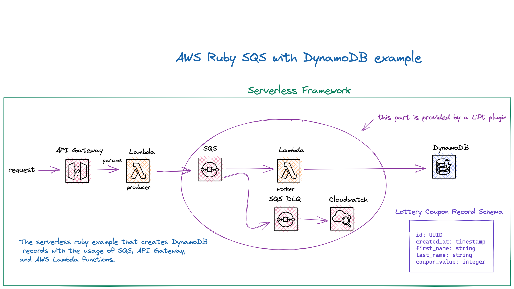
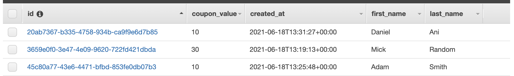
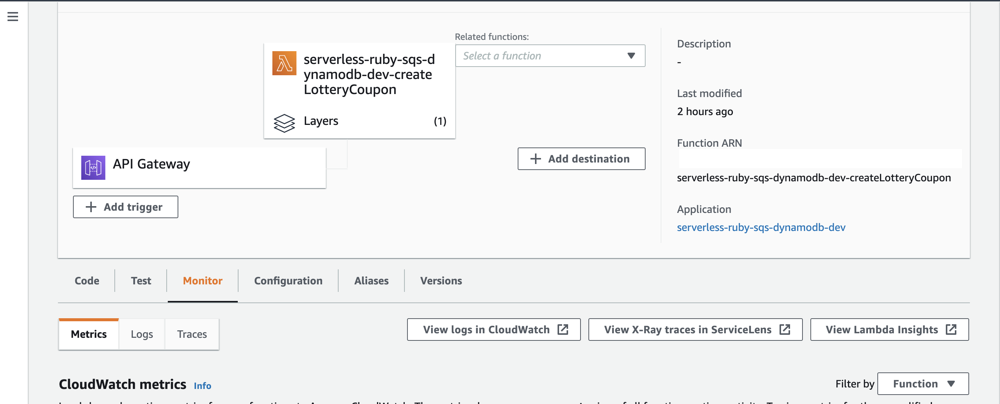
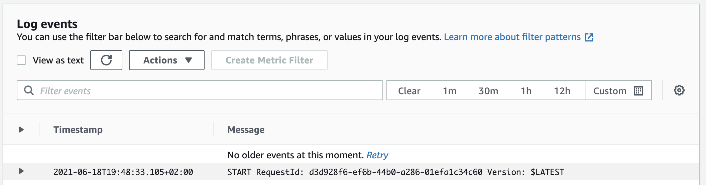
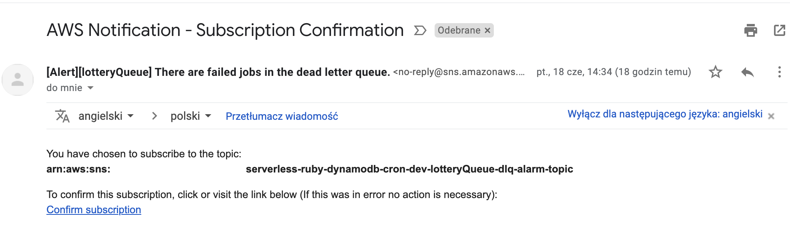

<!--
title: 'Serverless AWS Ruby SQS with DynamoDB example'
description: 'Serverless ruby example that creates DynamoDB records with the usage of SQS, API Gateway, and AWS Lambda functions.'
layout: Doc
framework: v2
platform: AWS
language: Ruby
priority: 5
authorLink: 'https://github.com/pigius'
authorName: 'Daniel Aniszkiewicz'
authorAvatar: 'https://avatars1.githubusercontent.com/u/8863200?s=200&v=4'
-->
# Serverless AWS Ruby SQS with DynamoDB example

This is an example of the usage of the `SQS` with `DynamoDB`, `API Gateway`, and `AWS Lambda` functions, and `Cloudwatch` for monitoring. The service is for the purpose of creating lottery coupons for people. Each and every coupon consists of the `id`, `first_name`, `last_name` and `coupon_value` as well as of `created_at` timestamp. API Gateway is triggering producing an SQS message, and then the consumer will create a record within the DynamoDB table. The incoming requests are validated with the usage of `dry-schema`.

For the purpose of SQS part, the `Lift` [construct](https://github.com/getlift/lift) was used, to allow using `AWS CDK` constructs functionalities. 


## Diagram



Regarding Lift queue construct:

- It creates an SQS queue with a worker running on AWS Lambda.
- A `worker` Lambda function, the purpose here is to process each and every message which is in the queue.
- An `SQS DLQ` the purpose here is to store all failed messages.
- `Cloudwatch` for alerting via email. Applies when SQS DLQ has failed messages, and the alerting option is enabled (in our case is true).


## Setup

`npm install` to install all needed packages.

## Deployment

In order to deploy the service run:

```bash
sls deploy
```

for deploying with a specific `profile` (located in `~/.aws/credentials`) you can simply use the command:

```bash
AWS_PROFILE=YOUR_PROFILE_NAME sls deploy
```

for deploying to the specific stage, let's say `staging` do:

```bash
sls deploy --stage staging
```

The expected result should be similar to:

```bash
Serverless: Running "serverless" installed locally (in service node_modules)
Serverless: Packaging service...
Serverless: Excluding development dependencies...
Serverless: Clearing previous build ruby layer build
[ '2.1' ]
Serverless: Installing gem using local bundler
Serverless: Zipping the gemfiles to examples/aws-ruby-sqs-with-dynamodb/.serverless/ruby_layer/gemLayer.zip
Serverless: Configuring Layer and GEM_PATH to the functions
Serverless: Uploading CloudFormation file to S3...
Serverless: Uploading artifacts...
Serverless: Uploading service serverless-ruby-sqs-dynamodb.zip file to S3 (7.71 KB)...
Serverless: Uploading service gemLayer.zip file to S3 (1.35 MB)...
Serverless: Validating template...
Serverless: Updating Stack...
Serverless: Checking Stack update progress...
...........................
Serverless: Stack update finished...
Service Information
service: serverless-ruby-sqs-dynamodb
stage: dev
region: your-region-here
stack: serverless-ruby-sqs-dynamodb-dev
resources: 22
api keys:
  None
endpoints:
  POST - https://XXXXXXXXXX.execute-api.your-region-here.amazonaws.com/dev/lottery
functions:
  createLotteryCoupon: serverless-ruby-sqs-dynamodb-dev-createLotteryCoupon
  lotteryQueueWorker: serverless-ruby-sqs-dynamodb-dev-lotteryQueueWorker
layers:
  gem: arn:aws:lambda:your-region-here:XXXXXXXXXXXXXX:layer:serverless-ruby-sqs-dynamodb-dev-ruby-bundle:3
lotteryQueue:
  queueUrl: https://sqs.your-region-here.amazonaws.com/XXXXXXXXXXXX/serverless-ruby-sqs-dynamodb-dev-lotteryQueue
```

## Usage

After the deployment, you will obtain the API Gateway endpoint. Simply send the POST request to it with params (either `curl`, or via `Postman`):

curl --request POST 'https://XXXXXXXXXX.execute-api.your-region-here.amazonaws.com/dev/lottery' --header 'Content-Type: application/json' --data-raw '{"first_name": "Daniel", "last_name": "Ani", "coupon_value": 99}'


The response to the above requests will be:

```bash
{
    "message": "Message sent"
}
```

To check created records check your DynamoDB table:




*Important*: The DynamoDB table name is a combination of service name and stage. For the `dev` stage it will be:

```
serverless-ruby-sqs-dynamodb-dev
```

### For checking the CloudWatch logs:

 - from lambda dashboard the `createLotteryCoupon` function:



 - directly from CloudWatch logs `createLotteryCoupon` function:



Same for the `lotteryQueueWorker` function.


## SQS

It is possible to configure email alerts in case messages end up in the `dead letter` queue. Within the queue construct edit the `alarm` value to your email.

Make sure, that you confirm the subscription to the AWS Notification through your email:




For more options, it's possible to set up more [settings](https://github.com/getlift/lift/blob/master/docs/queue.md).

## Log retention

The log retention is setup for 30 days. To change it simply change the value of this attribute in `serverless.yml` file:


``` bash
logRetentionInDays: 30
```

## Structure

| Path                                                     | Explanation                                                                                                                                                                                    |
|----------------------------------------------------------|------------------------------------------------------------------------------------------------------------------------------------------------------------------------------------------------|
| `./src`                                                  | All code for the project.                                                                                                                                                                      |
| `./src/handlers/handler`                                 | Lambda function for producing sqs messages.                                                                                                                                                    |
| `./src/handlers/worker`                                  | Lambda function for consuming sqs messages.                                                                                                                                                    |
| `./src/common/`                                          | Space for common, reusable pieces of code.                                                                                                                                                     |
| `./src/common/adapters/dynamo_db_adapter.rb`             | Adapter for communication with DynamoDB with the usage of AWS SDK for Ruby. Only used for creating new records.                                                                                |
| `./src/common/adapters/sqs_adapter.rb`                   | Adapter for communication with SQS with the usage of AWS SDK for Ruby. Only used for sending new messages to SQS.                                                                              |
| `./src/common/services/create_lottery_coupon_service.rb` | The service object pattern is widely used within ruby/rails developers. A class that is responsible for doing only one thing. In our case is creating a lottery coupon record to the DynamoDB. |
| `./src/common/services/create_sqs_message_service.rb`    | In our case is sending a message to SQS.                                                                                                                                                       |
| `./src/common/helpers/requests_helper.rb`                | Helper methods for requests. In our case, for parsing and symbolize hash keys.                                                                                                                 |
| `./src/common/schemas/lottery_coupon_schema.rb`          | Schemas for entities within the application. In our case, the schema with required keys and data types for lottery coupon.                                                                     |
| `./src/common/serializers/error_serializer.rb`           | Error serializer for 422 error. It gathers the dry-schema validation errors and puts them in a proper structure.                                                                               |
| `./src/common/validators/lottery_coupon_validator.rb`    | Validator for the lottery coupon record. It's validating the incoming request against the dry-schema structure and returns errors and information on whether the params are incorrect.         |
## Serverless plugins

For this example, there are two serverless plugins used:

| Plugin                | Explanation                                                                                    |
|-----------------------|------------------------------------------------------------------------------------------------|
| [serverless-ruby-layer](https://www.npmjs.com/package/serverless-ruby-layer) | For bundling ruby gems from `Gemfile` and deploys them to the lambda layer.                      |
| [serverless-lift](https://www.npmjs.com/package/serverless-lift)       | For using AWS CDK construct within the Serverless Framework. In this example, [queue construct](https://github.com/getlift/lift/blob/master/docs/queue.md). |

## Ruby gems

| Gem                | Explanation                                                                                                                    |
|--------------------|--------------------------------------------------------------------------------------------------------------------------------|
| `aws-sdk-dynamodb` | It's a part of the AWS SDK for Ruby. Used for DynamoDB, in the case of this example - the creation of the new record.          |
| `aws-sdk-sqs`      | It's a part of the AWS SDK for Ruby. Used for SQS, in the case of this example - produces and handles messages from the queue. |
| `dry-schema`       | For the purpose of the validation of the incoming requests. Validate both schema and data types.                               |

## Eject from the Lift plugin

A very cool aspect is the [eject](https://github.com/getlift/lift#ejecting)|. In case your project grows beyond the plugin, you can eject from `Lift` at any time, as the plugin is based on `CloudFormation`. You're not chained to Lift at all.

## Remove service

To remove the service do:

```bash
sls remove
```
And the stack will be removed from the AWS.
