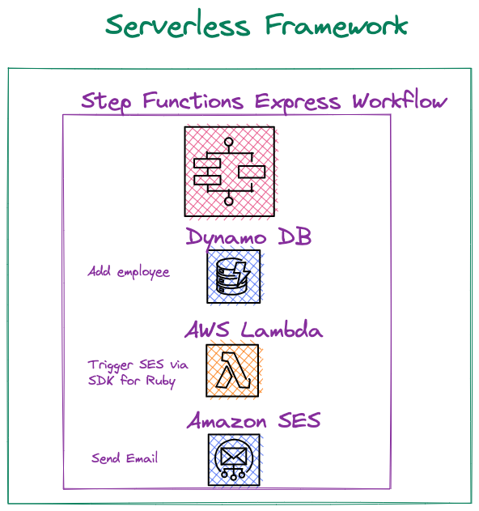
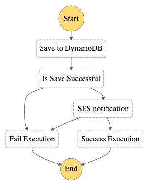
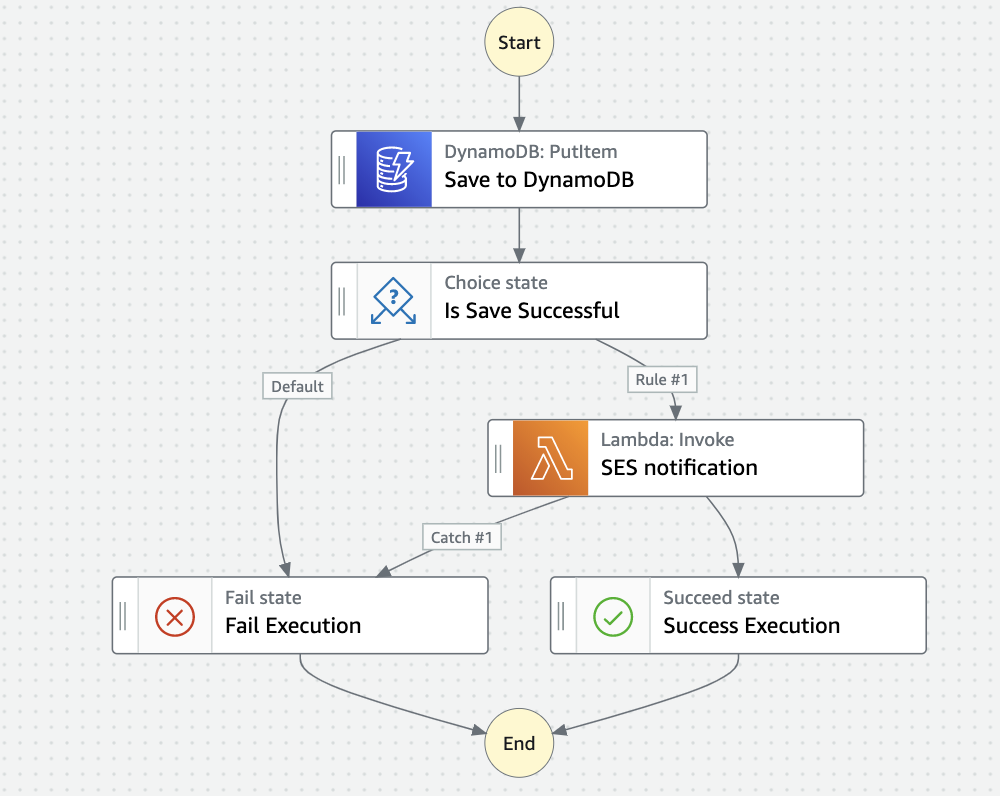
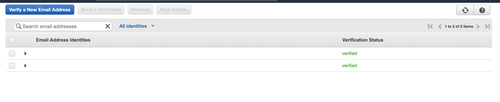
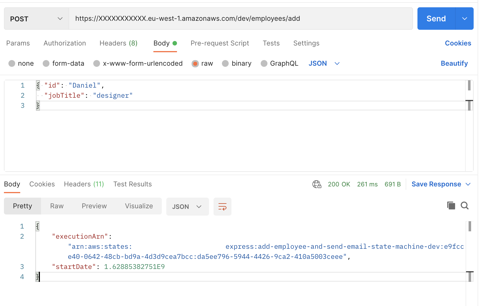
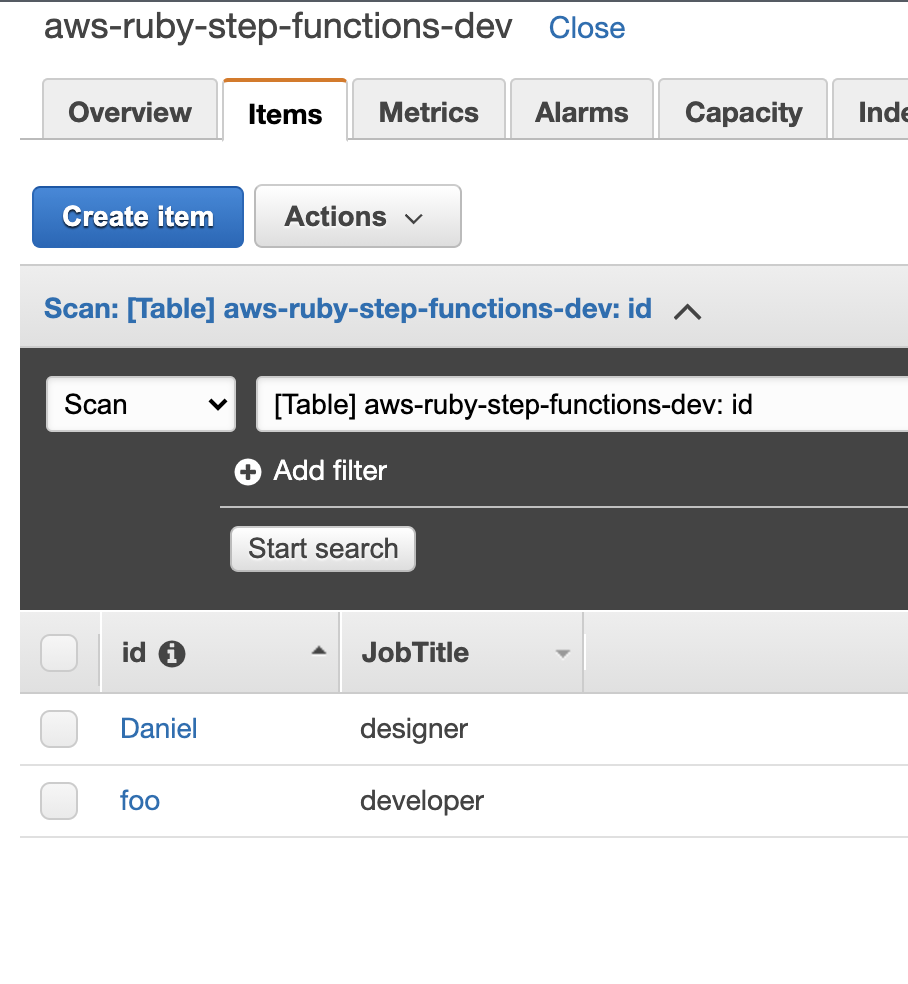
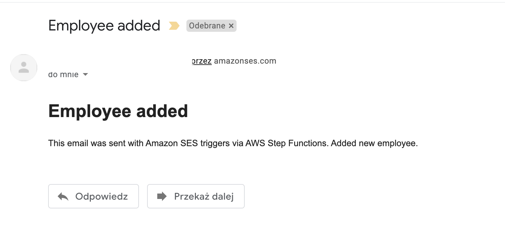
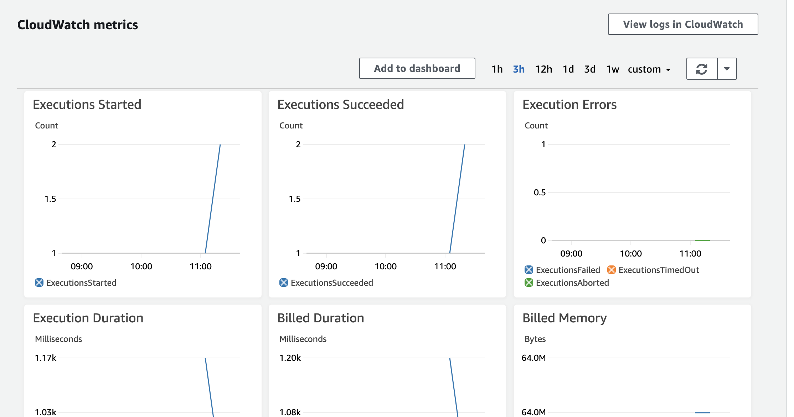

<!--
title: 'Ruby AWS Ruby Step Functions Express'
description: 'Ruby example that make usage of AWS Step Functions Express Type with AWS Lambda, DynamoDB, Amazon SES, API Gateway, and Step Functions flows.'
layout: Doc
framework: v2
platform: AWS
language: Ruby
authorLink: 'https://github.com/pigius'
authorName: 'Daniel Aniszkiewicz'
authorAvatar: 'https://avatars1.githubusercontent.com/u/8863200?s=200&v=4'
-->
# Serverless AWS Ruby Step Functions Express




This is an example of using `AWS Step Functions` `Express` Workflow Type. It uses `AWS Lambda`, `DynamoDB`, `Amazon SES`, `API Gateway` and `flows` from `Step Functions`.


## Diagram



It's a simple workflow, it adds the user to the database (`DynamoDB`) and if the save is successful, we send an email notification (`AWS Lambda` + `Amazon SES`). We also have error handling.



## Setup

`npm install` to install all needed packages.

## Deployment

In order to deploy the service run:

```bash
sls deploy
```

for deploying with a specific `profile` (located in `~/.aws/credentials`) you can simply use the command:

```bash
AWS_PROFILE=YOUR_PROFILE_NAME sls deploy
```

for deploying to the specific stage, let's say `staging` do:

```bash
sls deploy --stage staging
```

The expected result should be similar to:

```bash
Serverless: Running "serverless" installed locally (in service node_modules)
Serverless: Packaging service...
Serverless: Excluding development dependencies...
Serverless: Clearing previous build ruby layer build
[ '2.2' ]
Serverless: Installing gem using local bundler
Serverless: Zipping the gemfiles to sls-examples/examples/aws-ruby-step-functions-express/.serverless/ruby_layer/gemLayer.zip
Serverless: Configuring Layer and GEM_PATH to the functions
✓ State machine "myStateMachine" definition is valid
Serverless: Uploading CloudFormation file to S3...
Serverless: Uploading artifacts...
Serverless: Uploading service aws-ruby-step-functions.zip file to S3 (971.85 KB)...
Serverless: Uploading service gemLayer.zip file to S3 (553.86 KB)...
Serverless: Validating template...
Serverless: Updating Stack...
Serverless: Checking Stack update progress...
................................
Serverless: Stack update finished...
Service Information
service: aws-ruby-step-functions
stage: dev
region: eu-west-1
stack: aws-ruby-step-functions-dev
resources: 16
api keys:
  None
endpoints:
functions:
  send-email: aws-ruby-step-functions-dev-send-email
layers:
  gem: arn:aws:lambda:your-region:XXXXXXXXXXX:layer:aws-ruby-step-functions-dev-ruby-bundle:2
Serverless StepFunctions OutPuts
endpoints:
  POST - https://XXXXXXXXXXX.execute-api.your-region.amazonaws.com/dev/employees/add
```


## Prerequistes

Make sure to validate `sender` and `recipient` emails within the `Amazon SES` (most likely for testing it, it will be one `email`):



Later on within `serverless.yml` edit in `custom` section, both `sender` and `recipient`.

## Usage

There are two possible ways of invoking the example:

## Via Api Gateway

  After the deployment, grab the POST endpoint for this service. You can make a API call either by cURL or some tools like Postman.

Use payload like:

```json
{ 
  "id": "The name of the employee",
  "jobTitle": "the name of the employee's position"
}
```
As a response you will get:

```json
{
    "executionArn": "arn:aws:states:your-region:XXXXXXXXXXX:express:add-employee-and-send-email-state-machine-dev:e9fcce40-0642-48cb-bd9a-4d3d9cea7bcc:da5ee796-5944-4426-9ca2-410a5003ceee",
    "startDate": 1.62885382751E9
}
```




After it, you can then check the Dynamo database to see if a record has been created, and check the email.





## Via AWS Dashboard

After the deployment, go to the AWS Dashboard, and enter Step Functions page. You will see a newly created state machine.

Open the state machine and click on `Start Execution`. You need to provide the input in the JSON schema.

Example:

``` JSON
{
 "id": "The name of the employee",
 "jobTitle": "the name of the employee's position"
}
```

Later on, simply start the excecution.

After it, you can then check the Dynamo database to see if a record has been created, and check the email.


Please keep in mind, that the `Express workflow` is different from the `Standard workflow`. Check the differences [here](https://docs.aws.amazon.com/step-functions/latest/dg/concepts-standard-vs-express.html). The main point here is the fact that you can't see all transitions between states. However, you can still use Workflow Studio.


## Logs




By default, the logging is disabled. You can easily enabled it. The description is [here](https://www.serverless.com/plugins/serverless-step-functions#cloudwatch-logs).

## Log retention

The log retention is setup for 30 days. To change it simply change the value of this attribute in `serverless.yml` file:

``` bash
logRetentionInDays: 30
```

## Advanced configuration
More options could be found in the plugin [repository](https://github.com/serverless-operations/serverless-step-functions).

## Structure

| Path                                          | Explanation                                                                                                                                                     |
|-----------------------------------------------|-----------------------------------------------------------------------------------------------------------------------------------------------------------------|
| `./src`                                       | All code for the project.                                                                                                                                       |
| `./src/handlers/send-email`                   | Handler for lambda.                                                                                                                                             |
| `./src/common/`                               | Space for common, reusable pieces of code.                                                                                                                      |
| `./src/common/adapters/ses_adapter.rb`        | Adapter for the Amazon SES with the usage of AWS SDK for Ruby. Only used for sending emails.                                                                    |
| `./src/common/services/send_email_service.rb` | The service object pattern is widely used within ruby/rails developers. A class that is responsible for doing only one thing. In our case is creating an email. |                                                                             |
                                                                                                       
## Serverless plugins

For this example, there are two serverless plugins used:

| Plugin                | Explanation                                                                                    |
|-----------------------|------------------------------------------------------------------------------------------------|
| [serverless-ruby-layer](https://www.npmjs.com/package/serverless-ruby-layer) | For bundling ruby gems from `Gemfile` and deploys them to the lambda layer.                      |
| [serverless-step-functions](https://www.npmjs.com/package/serverless-step-functions)       | Serverless Framework plugin for AWS Step Functions. |

## Ruby gems

| Gem                | Explanation                                                                                                                    |
|--------------------|--------------------------------------------------------------------------------------------------------------------------------|
| `aws-sdk-ses` | It's a part of the AWS SDK for Ruby. Used for Amazon SES, in the case of this example - sending emails.          |

## Remove service

To remove the service do:

```bash
sls remove
```
And the stack will be removed from the AWS.