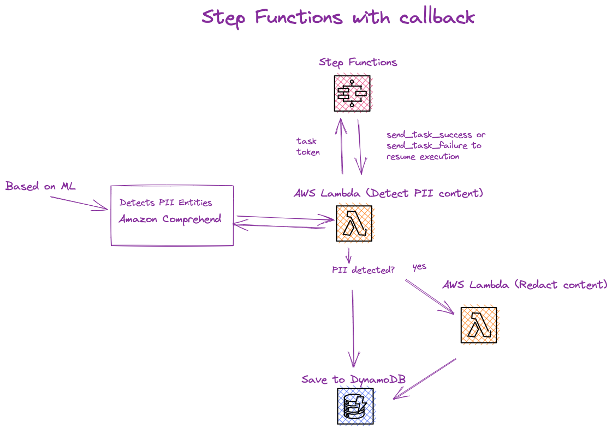
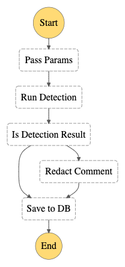
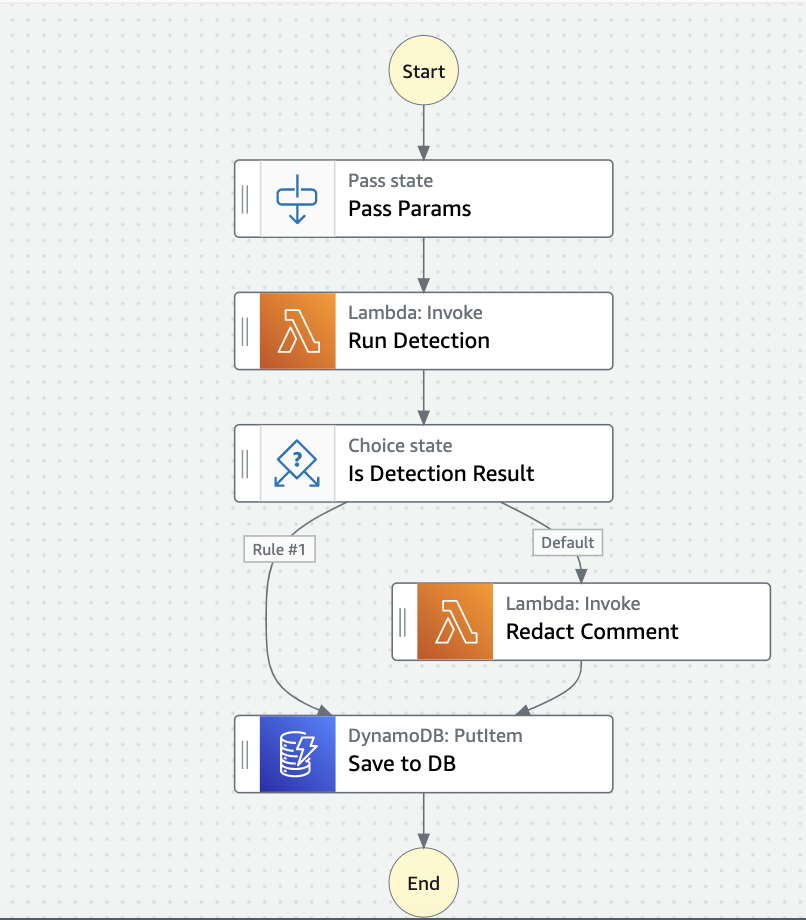
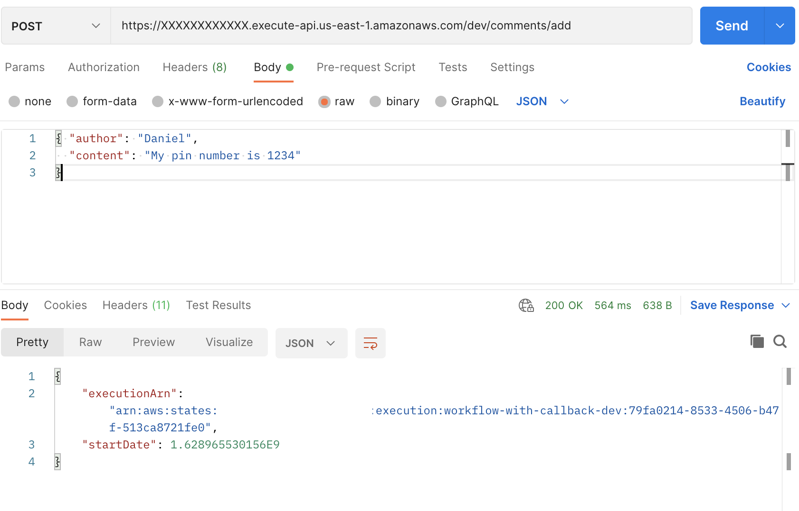
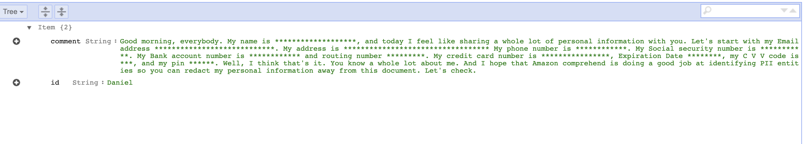
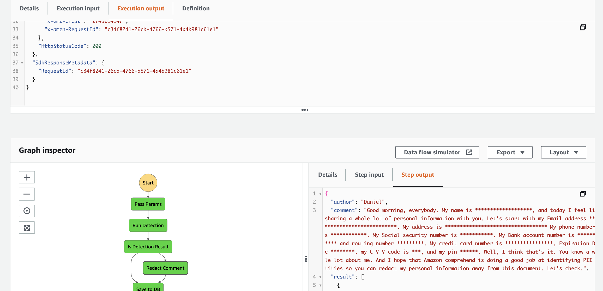
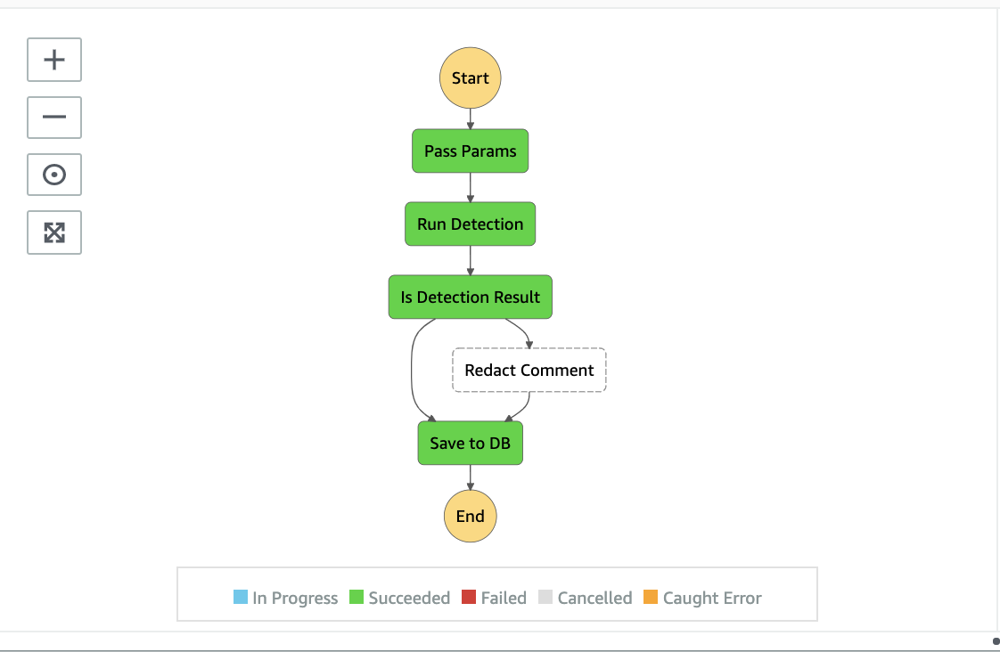

<!--
title: 'Ruby AWS Step Functions with Callback pattern'
description: 'Ruby example that make usage of AWS Step Functions with callback pattern, AWS Lambda, DynamoDB, Amazon Comprehend, API Gateway, and Step Functions flows.'
layout: Doc
framework: v2
platform: AWS
language: Ruby
authorLink: 'https://github.com/pigius'
authorName: 'Daniel Aniszkiewicz'
authorAvatar: 'https://avatars1.githubusercontent.com/u/8863200?s=200&v=4'
-->
# Ruby AWS Step Functions with Callback pattern

This is an example of using `AWS Step Functions` with [callback pattern](https://docs.aws.amazon.com/step-functions/latest/dg/callback-task-sample-sqs.html). It uses `AWS Lambda`, `DynamoDB`, `API Gateway`, `Amazon Comprehend`, `flows` from `Step Functions`.


## Diagram






This Workflow is quite simple. Assuming we have a comment system in our application, we would like to check for PII data before adding the comment to the database.

To do this, we use Amazon Comprehend which, based on trained ML models, checks if a given unstructured text contains sensitive data and returns information on which positions in the sentence it is located.

When detecting sensitive data with Amazon Comprehend, we use the `taskToken` from AWS `step functions` to wait for the detection results and continue our workflow.

Keep in mind, that `taskToken` is generated by Step Functions automatically.

Then, depending on the detection results, we perform a redaction process, replacing the sensitive data with an asterisk (*)

At the very end, the redacted comment is saved into the database (DynamoDB)




## Setup

`npm install` to install all needed packages.

## Deployment

In order to deploy the service run:

```bash
sls deploy
```

for deploying with a specific `profile` (located in `~/.aws/credentials`) you can simply use the command:

```bash
AWS_PROFILE=YOUR_PROFILE_NAME sls deploy
```

for deploying to the specific stage, let's say `staging` do:

```bash
sls deploy --stage staging
```

The expected result should be similar to:

```bash
Serverless: Running "serverless" installed locally (in service node_modules)
Serverless: Packaging service...
Serverless: Excluding development dependencies...
Serverless: Clearing previous build ruby layer build
[ '2.2' ]
Serverless: Installing gem using local bundler
Serverless: Zipping the gemfiles to /.serverless/ruby_layer/gemLayer.zip
Serverless: Configuring Layer and GEM_PATH to the functions
✓ State machine "WorkflowWithCallback" definition is valid
Serverless: Uploading CloudFormation file to S3...
Serverless: Uploading artifacts...
Serverless: Uploading service aws-ruby-step-functions-with-callback.zip file to S3 (137.4 KB)...
Serverless: Uploading service gemLayer.zip file to S3 (749.01 KB)...
Serverless: Validating template...
Serverless: Updating Stack...
Serverless: Checking Stack update progress...
.........................
Serverless: Stack update finished...
Service Information
service: aws-ruby-step-functions-with-callback
stage: dev
region: us-east-1
stack: aws-ruby-step-functions-with-callback-dev
resources: 19
api keys:
  None
endpoints:
functions:
  check-comment: aws-ruby-step-functions-with-callback-dev-check-comment
  redact-comment: aws-ruby-step-functions-with-callback-dev-redact-comment
layers:
  gem: arn:aws:lambda:your-region:XXXXXXXXXXX:layer:aws-ruby-step-functions-with-callback-dev-ruby-bundle:49
Serverless StepFunctions OutPuts
endpoints:
  POST - https://XXXXXXXXXXXX.execute-api.your-region.amazonaws.com/dev/comments/add
```

## Usage

There are two possible ways of invoking the example:

## Via Api Gateway

  After the deployment, grab the POST endpoint for this service. You can make a API call either by cURL or some tools like Postman.

Use payload like:

```json
{
  "comment": "My pin number is 1234",
  "author": "Daniel"
}
```

or something with more PII data included:

```json
{
  "comment": "Good morning, everybody. My name is Van Bokhorst Serdar, and today I feel like sharing a whole lot of personal information with you. Let's start with my Email address SerdarvanBokhorst@dayrep.com. My address is 2657 Koontz Lane, Los Angeles, CA. My phone number is 818-828-6231. My Social security number is 548-95-6370. My Bank account number is 940517528812 and routing number 195991012. My credit card number is 5534816011668430, Expiration Date 6/1/2022, my C V V code is 121, and my pin 123456. Well, I think that's it. You know a whole lot about me. And I hope that Amazon comprehend is doing a good job at identifying PII entities so you can redact my personal information away from this document. Let's check.",
  "author": "Daniel"
}
```
As a response you will get:

```json
{
    "executionArn": "arn:aws:states:your-region:XXXXXXXXXXXX:execution:workflow-with-callback-dev:79fa0214-8533-4506-b47f-513ca8721fe0",
    "startDate": 1.628965530156E9
}
```




After it, you can then check the Dynamo database to see if a record has been created.




## Via AWS Dashboard

After the deployment, go to the AWS Dashboard, and enter Step Functions page. You will see a newly created state machine.

Open the state machine and click on `Start Execution`. You need to provide the input in the JSON schema.

Example:

```json
{
  "comment": "My pin number is 1234",
  "author": "Daniel"
}
```

or something with more PII data included:

```json
{
  "comment": "Good morning, everybody. My name is Van Bokhorst Serdar, and today I feel like sharing a whole lot of personal information with you. Let's start with my Email address SerdarvanBokhorst@dayrep.com. My address is 2657 Koontz Lane, Los Angeles, CA. My phone number is 818-828-6231. My Social security number is 548-95-6370. My Bank account number is 940517528812 and routing number 195991012. My credit card number is 5534816011668430, Expiration Date 6/1/2022, my C V V code is 121, and my pin 123456. Well, I think that's it. You know a whole lot about me. And I hope that Amazon comprehend is doing a good job at identifying PII entities so you can redact my personal information away from this document. Let's check.",
  "author": "Daniel"
}
```

Later on, simply start the excecution.

After it, you can then check the Dynamo database to see if a record has been created.

As we use `Standard` workflow type, feel free to check the executions:




If there are no detections, the redaction process will not be triggered, so flow will look like this:




## Log retention

The log retention is setup for 30 days. To change it simply change the value of this attribute in `serverless.yml` file:


``` bash
logRetentionInDays: 30
```

## Advanced configuration
More options (like alerting in case of failed excecutions), could be found in the plugin [repository](https://github.com/serverless-operations/serverless-step-functions).

## Structure

| Path                                          | Explanation                                                                                                                                                     |
|-----------------------------------------------|-----------------------------------------------------------------------------------------------------------------------------------------------------------------|
| `./src`                                       | All code for the project.                                                                                                                                       |
| `./src/handlers/send_token`                   | Handler for lambda.                                                                                                                                             |
| `./src/common/`                               | Space for common, reusable pieces of code.                                                                                                                      |
| `./src/common/adapters/step_functions_adapter.rb`        | Adapter for the AWS Step Functions with the usage of AWS SDK for Ruby. Only used for sending success and failure task_token.                                                                    |
| `./src/common/services/send_task_token_service.rb` | The service object pattern is widely used within ruby/rails developers. A class that is responsible for doing only one thing. In our case is handling task token. |        
| `./src/common/services/detection_service.rb` | Responsible for making detection with Amazon Comprehend to detect PII data. |      
| `./src/common/services/redaction_service.rb` | Responsible for redacting comment based on the Amazon Comprehend detection results. |          

## Serverless plugins

For this example, there are two serverless plugins used:

| Plugin                | Explanation                                                                                    |
|-----------------------|------------------------------------------------------------------------------------------------|
| [serverless-ruby-layer](https://www.npmjs.com/package/serverless-ruby-layer) | For bundling ruby gems from `Gemfile` and deploys them to the lambda layer.                      |
| [serverless-step-functions](https://www.npmjs.com/package/serverless-step-functions)       | Serverless Framework plugin for AWS Step Functions. |

## Ruby gems

| Gem                | Explanation                                                                                                                    |
|--------------------|--------------------------------------------------------------------------------------------------------------------------------|
| `aws-sdk-comprehend` | It's a part of the AWS SDK for Ruby. Used for Amazon Comprehend, in the case of this example - the detection of the PII data.          |
| `aws-sdk-dynamodb` | It's a part of the AWS SDK for Ruby. Used for DynamoDB, in the case of this example - the creation of the new record.          |
| `aws-sdk-states` | It's a part of the AWS SDK for Ruby. Used for AWS Step Functions. |

## Remove service

To remove the service do:

```bash
sls remove
```
And the stack will be removed from the AWS.