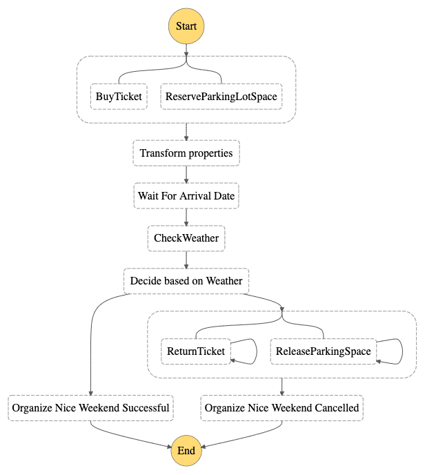
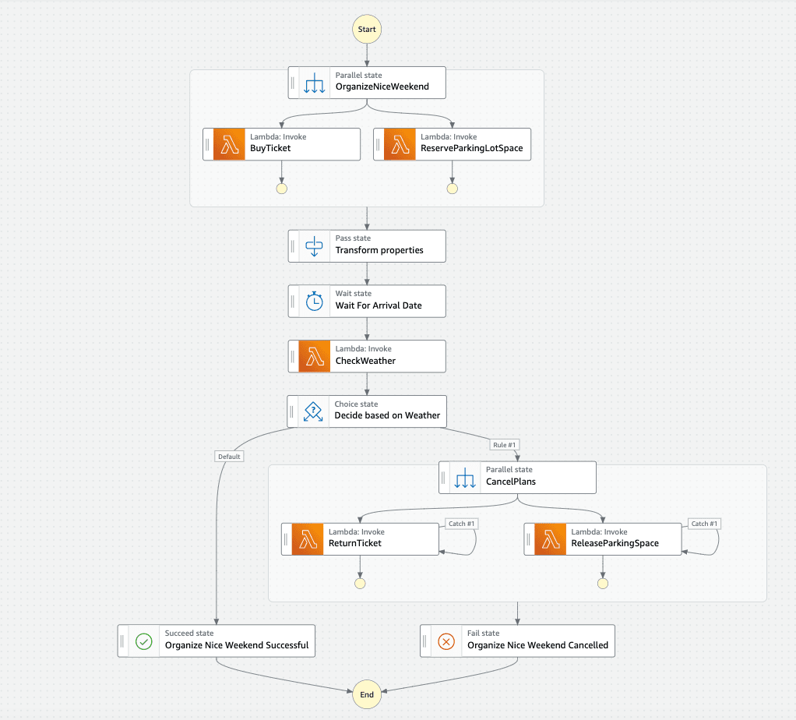
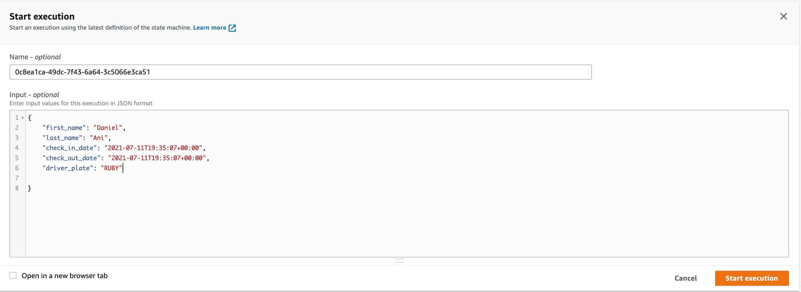
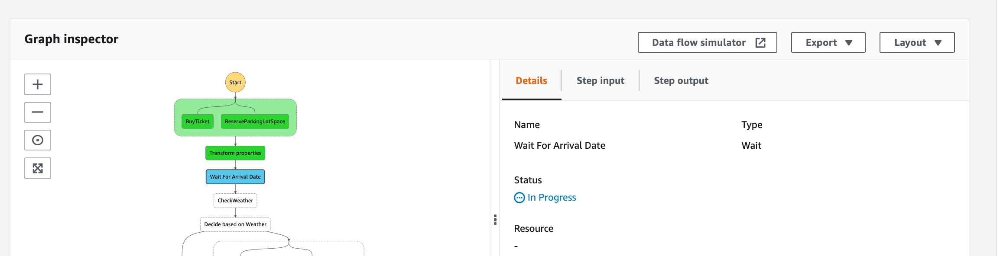
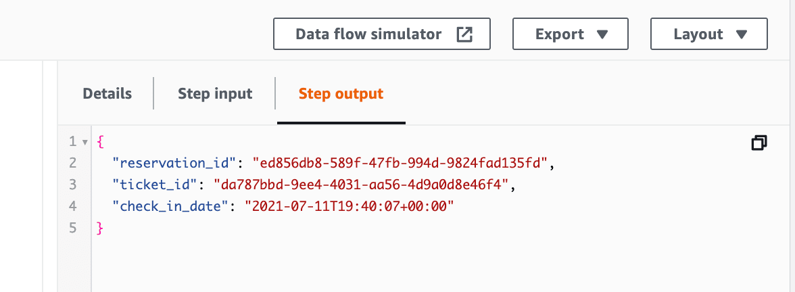
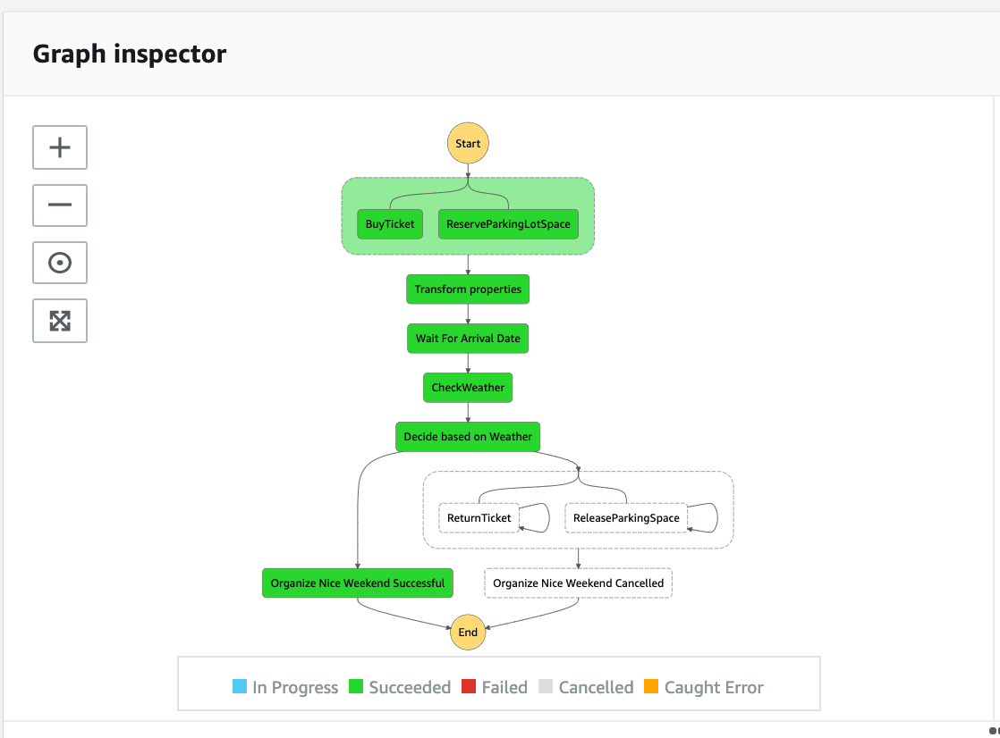
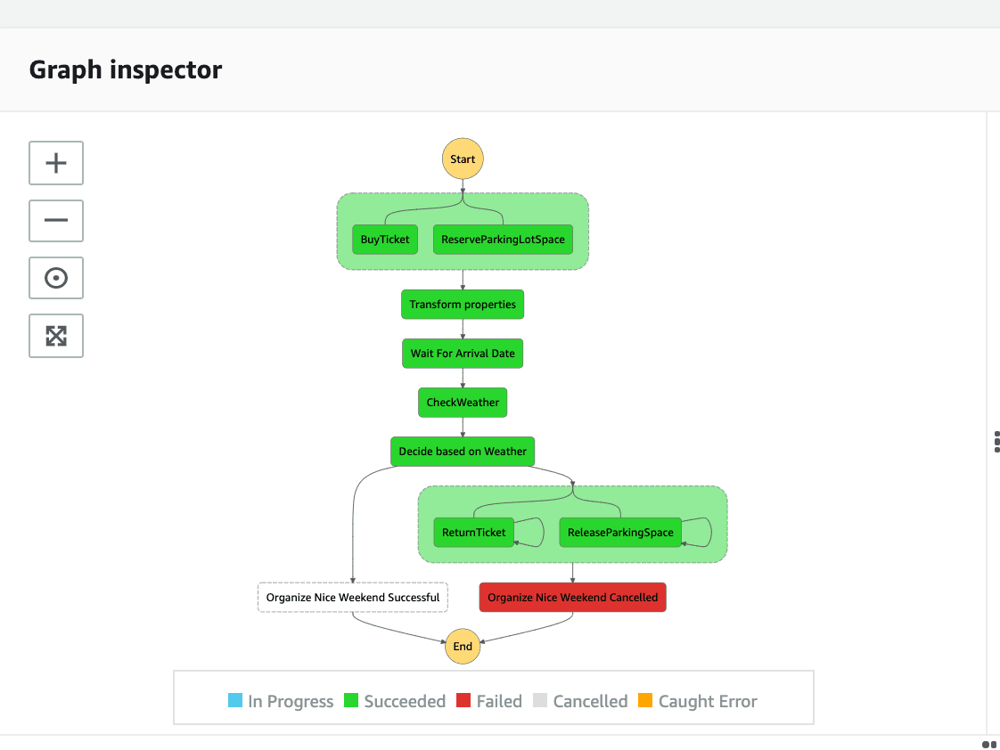

<!--
title: 'Serverless AWS Ruby Step Functions'
description: 'Serverless ruby example that make usage of AWS Step Functions with AWS Lambda, DynamoDB and Step Functions flows.'
layout: Doc
framework: v2
platform: AWS
language: Ruby
authorLink: 'https://github.com/pigius'
authorName: 'Daniel Aniszkiewicz'
authorAvatar: 'https://avatars1.githubusercontent.com/u/8863200?s=200&v=4'
-->
# Serverless AWS Ruby Step Functions

This is an example of using `AWS Step Functions` `Standard` Workflow Type. It uses `AWS Lambda`, `DynamoDB` (create and update, 2 separate databases), and `flows` from `Step Functions`.


## Diagram



The workflow used as an example is organising a holiday for example out of town. 

Here we have two dynamodb tables:

- `tickets` table for tickets
- `parking-lot-spaces` table for parking spaces


The workflow first creates a record for us to buy a ticket, and to book a parking space (as Parallel state), and then waits for the day on which the tour is to take place (Wait State timestamp as check_in_date), and it checks the weather.

Depending on the weather, the workflow is successful if the weather is good. Otherwise (bad weather), both the ticket and the parking space are cancelled.

This can be considered a Saga pattern.



## Setup

`npm install` to install all needed packages.

## Deployment

In order to deploy the service run:

```bash
sls deploy
```

for deploying with a specific `profile` (located in `~/.aws/credentials`) you can simply use the command:

```bash
AWS_PROFILE=YOUR_PROFILE_NAME sls deploy
```

for deploying to the specific stage, let's say `staging` do:

```bash
sls deploy --stage staging
```

The expected result should be similar to:

```bash
Serverless: Packaging service...
Serverless: Excluding development dependencies...
Serverless: Clearing previous build ruby layer build
[ '2.2' ]
Serverless: Installing gem using local bundler
Serverless: Zipping the gemfiles to ../examples/aws-ruby-step-functions/.serverless/ruby_layer/gemLayer.zip
Serverless: Configuring Layer and GEM_PATH to the functions
✓ State machine "myStateMachine" definition is valid
Serverless: Uploading CloudFormation file to S3...
Serverless: Uploading artifacts...
Serverless: Uploading service serverless-ruby-step-functions.zip file to S3 (1.03 MB)...
Serverless: Uploading service gemLayer.zip file to S3 (640.83 KB)...
Serverless: Validating template...
Serverless: Updating Stack...
Serverless: Checking Stack update progress...
.................................................................................
Serverless: Stack update finished...
Service Information
service: serverless-ruby-step-functions
stage: dev
region: us-east-1
stack: serverless-ruby-step-functions-dev
resources: 23
api keys:
  None
endpoints:
  None
functions:
  buy-ticket: serverless-ruby-step-functions-dev-buy-ticket
  reserve-parking-lot-space: serverless-ruby-step-functions-dev-reserve-parking-lot-space
  return-ticket: serverless-ruby-step-functions-dev-return-ticket
  release-parking-space: serverless-ruby-step-functions-dev-release-parking-space
  check-weather: serverless-ruby-step-functions-dev-check-weather
layers:
  gem: arn:aws:lambda:YOUR_REGION:XXXXXXXXXXX:layer:serverless-ruby-step-functions-dev-ruby-bundle:59
```

## Usage


After the deployment, go to the AWS Dashboard, and enter Step Functions page. You will see a newly created state machine.

Open the  `organize-nice-weekend-state-machine` state machine and click on `Start Execution`. You need to provide the input in the JSON schema.

Example:

``` JSON
{
  "first_name": "Daniel",
  "last_name": "Ani",
  "check_in_date": "2021-07-11T19:35:07+00:00",
  "check_out_date": "2021-07-11T19:35:07+00:00",
  "driver_plate": "RUBY"
}
```



The `check_in_date` is the most important one. Without it, the state machine will be failed (it's needed for the purpose of the Wait state).




Later on, simply start the excecution.

You can watch live as the change between states takes place. It is also possible to view every parameter going in and out of each state.

The` weather` attribute is returned randomly (either `good` or `bad`), so sometimes you need several executions of the state machine to get a failed execution.



To check created records check your DynamoDB tables (both for tickets, and parking lot spaces). In both cases, you will see that for failure executions, the `current_status` for records, will be changed to `canceled`.

Happy Path (good weather)



Unhappy path (bad weather)




## Log retention

The log retention is setup for 30 days. To change it simply change the value of this attribute in `serverless.yml` file:


``` bash
logRetentionInDays: 30
```

## Advanced configuration
More options (like alerting in case of failed excecutions), could be found in the plugin [repository](https://github.com/serverless-operations/serverless-step-functions).

## Structure

| Path                                                     | Explanation                                                                                                                                                                                    |
|----------------------------------------------------------|------------------------------------------------------------------------------------------------------------------------------------------------------------------------------------------------|
| `./src`                                                  | All code for the project.                                                                                                                                                                      |
| `./src/handlers/buy_ticket`                                 | Lambda function for creating a ticket.                                                                                                                                                    |
| `./src/handlers/return_ticket`                                  | Lambda function for returning the ticket.                                                                                                                                                    |
| `./src/handlers/reserve_parking_lot_space`                                  | Lambda function for reserving the parking lot space.                                                                                                                                                    |
| `./src/handlers/release_parking_space`                                  | Lambda function for releasing the parking spaceticket.                                                                                                                                                    |
| `./src/handlers/check_weather`                                  | Lambda function for checking weather.                                                                                                                                                    |
| `./src/common/`                                          | Space for common, reusable pieces of code.                                                                                                                                                     |
| `./src/common/adapters/dynamo_db_adapter.rb`             | Adapter for communication with DynamoDB with the usage of AWS SDK for Ruby. Used for creating new records and updating existing ones.                                                                                |
| `./src/common/services/ticket_service.rb`             | The service object pattern is widely used within ruby/rails developers. In our case used for all things related to tickets, so creating and updating records within DynamoDB.                                                                                |
| `./src/common/adapters/reserve_parking_service.rb`             | In our case used for all things related to parking reservations, so creating and updating records within DynamoDB.                                                                                |
                                                                                                       
## Serverless plugins

For this example, there are two serverless plugins used:

| Plugin                | Explanation                                                                                    |
|-----------------------|------------------------------------------------------------------------------------------------|
| [serverless-ruby-layer](https://www.npmjs.com/package/serverless-ruby-layer) | For bundling ruby gems from `Gemfile` and deploys them to the lambda layer.                      |
| [serverless-step-functions](https://www.npmjs.com/package/serverless-step-functions)       | Serverless Framework plugin for AWS Step Functions. |

## Ruby gems

| Gem                | Explanation                                                                                                                    |
|--------------------|--------------------------------------------------------------------------------------------------------------------------------|
| `aws-sdk-dynamodb` | It's a part of the AWS SDK for Ruby. Used for DynamoDB, in the case of this example - the creation of the new record.          |

## Remove service

To remove the service do:

```bash
sls remove
```
And the stack will be removed from the AWS.