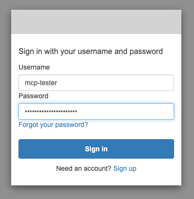
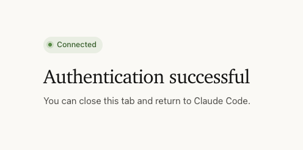

<!--
title: 'AWS MCP Server with Amazon Cognito OAuth (NodeJS)'
description: 'Protect an MCP server with an Amazon Cognito user pool validated by API Gateway - zero token-verification code, a self-contained pool and app client, machine-to-machine tokens, with the Serverless Framework.'
layout: Doc
framework: v4
platform: AWS
language: nodeJS
authorLink: 'https://github.com/serverless'
authorName: 'Serverless, Inc.'
authorAvatar: 'https://avatars1.githubusercontent.com/u/13742415?s=200&v=4'
-->

# MCP Server with Amazon Cognito OAuth

The zero-code OAuth member of the [MCP examples](../README.md). The [Framework never verifies tokens](https://www.serverless.com/framework/docs/providers/aws/guide/mcp#authentication) — enforcement is yours — and this example puts all of it where it costs the least: an **Amazon Cognito user pool authorizer**, validated by API Gateway itself. A rejected request invokes nothing: not the server function, and no authorizer function either, because there isn't one. The server module stays a plain SDK server; every AWS resource involved — the pool, its OAuth scope, a machine-to-machine app client — is declared in this example's `resources:`, so one deploy stands up the whole story and one `remove` tears it down.

```yaml
mcp:
  servers:
    demo:
      server: src/server.mjs
      authorizer:
        name: demoPool
        type: COGNITO_USER_POOLS
        arn: !GetAtt UserPool.Arn
        scopes:
          - mcp/invoke
      oauthDiscovery:
        issuer: !Sub "https://cognito-idp.${AWS::Region}.amazonaws.com/${UserPool}"
```

Three things in that block are load-bearing:

- **`name` and `type` are written out** because the pool lives in this stack: with `arn` as a `Fn::GetAtt` there is no literal ARN to derive them from. (A pool that already exists is referenced by its literal ARN instead, and still needs the `name` — the one API Gateway would derive from a pool ARN is not a valid CloudFormation identifier.)
- **`scopes` selects access tokens.** With scopes configured, API Gateway validates the caller's Cognito **access token** against them; with no scopes it validates identity tokens instead — and a `client_credentials` client mints only access tokens, so without the scope nothing this example creates could call it.
- **`oauthDiscovery` is advertisement, not enforcement.** It publishes the RFC 9728 protected-resource document so clients can find the authorization server; the authorizer above is what actually rejects. The document is rendered at deploy time, and the pool id inside the issuer exists only once the stack is created — which is why the issuer is a [CloudFormation intrinsic](https://www.serverless.com/framework/docs/providers/aws/guide/mcp#an-issuer-created-by-the-same-stack) rather than a literal URL: the `!Sub` is resolved by the same deploy that creates the pool, so the published document names the real issuer from the start.

## What the gate accepts

Acceptance is scoped to the **pool and the scope, never to a client**: a token from _any_ app client of the same pool carrying `mcp/invoke` is accepted, and API Gateway does not narrow further. Per-client access control therefore means distinct scopes — or distinct pools. Rejections are API Gateway's own bare responses, and they are all the same one: a `401` (`{"message":"Unauthorized"}`) whether the token is missing, unverifiable, or verified but lacking the scope — never the MCP specification's challenge, and never a status code that says which failure it was, so a scope problem looks exactly like no token at all. The bare `401` is still enough to start the official SDK client's OAuth flow. When you need the spec's semantics — per-scope `403`s, `WWW-Authenticate` challenges, the caller's identity inside your tools — that is the [oauth-in-module](../oauth-in-module) example, and the two compose.

## Deployment

```bash
npm install
serverless deploy
```

One deploy stands up everything — the pool, its scope, the app client, the server, and the discovery document, which names the real pool from the start: the `!Sub` in the issuer is resolved by the same deploy that creates the pool. If you fetch the document right after a deploy that changed it, give it a minute or two — API Gateway can briefly keep serving the previous body after the deploy returns, and it converges on its own.

The deploy also prints a warning that the discovery document lives at the stage URL, where interactive clients cannot discover it. That is expected on this example's default endpoint: the [Interactive clients](#interactive-clients-need-a-custom-domain) section below is the fix, and the machine-to-machine caller this example centers on never reads the document at all.

```
mcp: demo → https://abc123def.execute-api.us-east-1.amazonaws.com/dev/demo/mcp
```

Set `ENDPOINT` to that URL for everything below.

## Testing

### The negatives first — no code of yours runs for these

No token is API Gateway's own bare `401`. No MCP challenge, and no invocation — `serverless logs -f demo` has nothing to show and says so with an error, `No existing streams for the function`: nothing has ever invoked the function, so the log group the deploy created holds no streams yet:

```bash
curl -sS -o /dev/null -w '%{http_code}\n' -X POST "$ENDPOINT" \
  -H 'content-type: application/json' \
  -H 'accept: application/json, text/event-stream' \
  -H 'mcp-method: tools/list' \
  -d '{"jsonrpc":"2.0","id":1,"method":"tools/list","params":{"_meta":{"io.modelcontextprotocol/protocolVersion":"2026-07-28","io.modelcontextprotocol/clientCapabilities":{}}}}'
```

```
401
```

A garbage token gets the same `401` — API Gateway judged it against the pool's keys and rejected it, still without invoking anything:

```bash
curl -sS -o /dev/null -w '%{http_code}\n' -X POST "$ENDPOINT" \
  -H 'content-type: application/json' \
  -H 'accept: application/json, text/event-stream' \
  -H 'mcp-method: tools/list' \
  -H 'authorization: Bearer not-a-token' \
  -d '{"jsonrpc":"2.0","id":1,"method":"tools/list","params":{"_meta":{"io.modelcontextprotocol/protocolVersion":"2026-07-28","io.modelcontextprotocol/clientCapabilities":{}}}}'
```

```
401
```

The discovery document reads without a token — the authorizer is deliberately never wired to that route, because a client has to learn where to log in before it has anything to present. Its well-known path sits between the stage root and the server path, so derive it from `ENDPOINT` rather than typing it:

```bash
DISCOVERY="${ENDPOINT%/demo/mcp}/.well-known/oauth-protected-resource/demo/mcp"
curl -sS "$DISCOVERY"
```

```json
{
  "resource": "https://abc123def.execute-api.us-east-1.amazonaws.com/dev/demo/mcp",
  "authorization_servers": [
    "https://cognito-idp.us-east-1.amazonaws.com/us-east-1_XXXXXXXXX"
  ],
  "bearer_methods_supported": ["header"]
}
```

### Mint a token and call a tool

Everything a caller needs is in the stack's outputs, except the client secret, which Cognito holds — read it with `describe-user-pool-client`:

```bash
STACK=mcp-oauth-cognito-dev # <service>-<stage>: the -dev suffix tracks the stage you deployed to
out() { aws cloudformation describe-stacks --stack-name "$STACK" \
  --query "Stacks[0].Outputs[?OutputKey=='$1'].OutputValue" --output text; }

POOL_ID=$(out UserPoolId)
CLIENT_ID=$(out ClientId)
TOKEN_ENDPOINT=$(out TokenEndpoint)
CLIENT_SECRET=$(aws cognito-idp describe-user-pool-client \
  --user-pool-id "$POOL_ID" --client-id "$CLIENT_ID" \
  --query 'UserPoolClient.ClientSecret' --output text)

TOKEN=$(curl -sS -X POST "$TOKEN_ENDPOINT" \
  -H 'content-type: application/x-www-form-urlencoded' \
  -u "$CLIENT_ID:$CLIENT_SECRET" \
  -d 'grant_type=client_credentials&scope=mcp/invoke' \
  | node -e 'process.stdin.on("data",d=>console.log(JSON.parse(d).access_token))')
```

```bash
curl -sS -X POST "$ENDPOINT" \
  -H 'content-type: application/json' \
  -H 'accept: application/json, text/event-stream' \
  -H 'mcp-method: tools/call' -H 'mcp-name: add' \
  -H "authorization: Bearer $TOKEN" \
  -d '{"jsonrpc":"2.0","id":1,"method":"tools/call","params":{"name":"add","arguments":{"a":2,"b":40},"_meta":{"io.modelcontextprotocol/protocolVersion":"2026-07-28","io.modelcontextprotocol/clientInfo":{"name":"curl","version":"1.0.0"},"io.modelcontextprotocol/clientCapabilities":{}}}}'
```

```json
{
  "result": {
    "content": [{ "type": "text", "text": "42" }],
    "structuredContent": { "sum": 42 },
    "resultType": "complete"
  },
  "jsonrpc": "2.0",
  "id": 1
}
```

(Trimmed — the live response also carries a `_meta` block naming the server.)

The [hub README](../README.md) has the official-client script (pass the token as `BEARER`) and the capability matrix that applies to every example in the family.

## Claude Code

The same minted token also puts **Claude Code** on this endpoint — no custom domain, no login flow, because the header carries what the login flow would have obtained. The `--` is required after `--header`, which takes multiple values and would otherwise swallow the name and URL that follow it; commands without `--header` need no separator:

```bash
claude mcp add --transport http --header "Authorization: Bearer $TOKEN" -- demo "$ENDPOINT"
claude mcp list
```

```
demo: https://abc123def.execute-api.us-east-1.amazonaws.com/dev/demo/mcp (HTTP) - ✔ Connected
```

```bash
claude -p "call the add tool from the demo MCP server with a=2 b=40" --allowedTools "mcp__demo__add"
```

```
`add(a=2, b=40)` → `{"sum": 42}`
```

The phrasing of that reply is the model's and varies run to run; what it reliably carries is the tool's answer, obtained through the full authenticated path. The header is pasted once and never refreshed, so calls start answering `401` when the token expires (an hour, on this pool's defaults) — re-add with a fresh token, or use the interactive flow below, which obtains and refreshes tokens itself. `claude mcp remove demo` deregisters it.

## Interactive clients need a custom domain

Everything above is machine-to-machine: the caller mints its own token and sends it. An **interactive** client — Claude Code, an IDE assistant — instead discovers your authorization server from the endpoint and runs a browser login, and on the raw `execute-api` URL that discovery cannot work: clients probe `/.well-known/oauth-protected-resource` and its siblings relative to the **origin root**, and on `execute-api` the document sits under the stage prefix (`/dev/.well-known/…`) where no conventional probe looks. A client whose probes all miss can quietly fall back to treating the endpoint's own origin as the authorization server and open `<origin>/authorize` — a URL nothing serves — so the symptom is a sign-in page that never loads, not an error.

A [custom domain](https://www.serverless.com/framework/docs/providers/aws/guide/domains) mapped at the root fixes it — the stage prefix disappears, and the document sits exactly where every probe looks:

```yaml
provider:
  domain: mcp.example.com # root-mapped: no basePath
```

Two Cognito-specific things to arrange alongside the domain:

- **Cognito has no Dynamic Client Registration**, so an interactive client cannot register itself — pre-register an authorization-code + PKCE app client (no secret, a fixed `http://localhost:<port>/callback` redirect) and hand its id to the client. A user to log in as completes the picture:

  ```bash
  CALLBACK_PORT=8976
  INTERACTIVE_CLIENT_ID=$(aws cognito-idp create-user-pool-client \
    --user-pool-id "$POOL_ID" --client-name interactive --no-generate-secret \
    --allowed-o-auth-flows code \
    --allowed-o-auth-scopes openid mcp/invoke \
    --allowed-o-auth-flows-user-pool-client \
    --supported-identity-providers COGNITO \
    --callback-urls "http://localhost:$CALLBACK_PORT/callback" \
    --query 'UserPoolClient.ClientId' --output text)

  aws cognito-idp admin-create-user --user-pool-id "$POOL_ID" \
    --username mcp-tester --message-action SUPPRESS \
    --user-attributes Name=email,Value=mcp-tester@example.com Name=email_verified,Value=true
  aws cognito-idp admin-set-user-password --user-pool-id "$POOL_ID" \
    --username mcp-tester --password 'ChangeMe!2026' --permanent
  ```

- Redeploy after setting the domain, so the discovery document advertises it — and point every client at the domain URL from then on: a spec-conformant client that reaches the server on the old `execute-api` URL sees a `resource` naming a different origin than the one it called, and refuses the server.

With both in place, Claude Code runs the whole flow itself:

```bash
claude mcp add --transport http --client-id "$INTERACTIVE_CLIENT_ID" \
  --callback-port 8976 demo https://mcp.example.com/demo/mcp
claude
```

The two extra flags are what stand in for Dynamic Client Registration: because Cognito has no DCR, the client cannot register itself, so you hand it the pre-registered client id — and since a pre-registered client carries a fixed redirect URI, the callback port has to match it too. Against an issuer that does support registration, the same command needs only the URL; the [oauth-authorizer README](../oauth-authorizer/README.md#claude-code-url-only-dynamic-client-registration) covers that path.

Ask it to use the server; it discovers the issuer, finds it needs authorization, and hands you the hosted-UI URL to sign in on:



The redirect completes the flow back to Claude:



The logged-in calls then pass the gate. What makes them pass is scope: the pool authorizer accepts only access tokens carrying `mcp/invoke`, which is why the pre-registered client above enables `openid mcp/invoke` — and when a client's request names no scopes, Cognito issues the token with every scope enabled on the app client. If a post-login call answers `401` anyway, what the client sent to `/oauth2/authorize` is the first thing to check.

## Clean up

```bash
serverless remove
```

The pool, its domain, and the app client are stack resources, so they leave with the stack. If you registered the server with Claude Code, also `claude mcp remove demo`.
