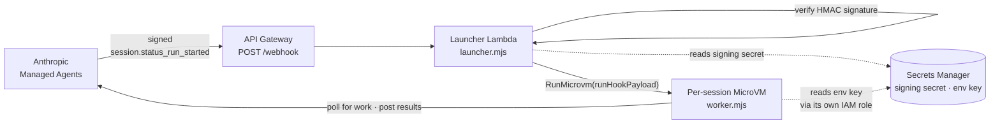
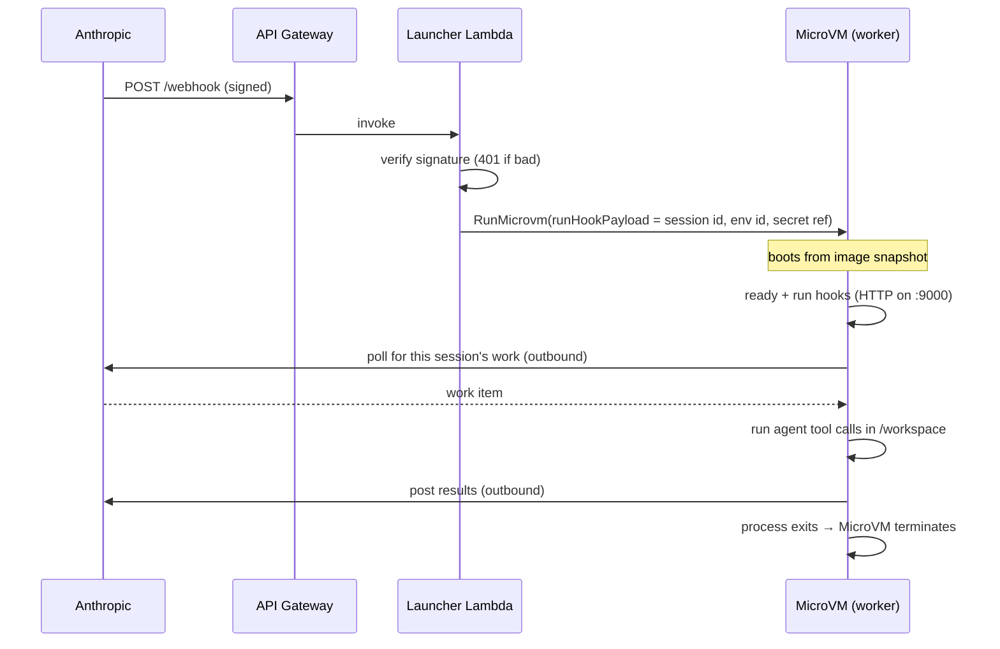
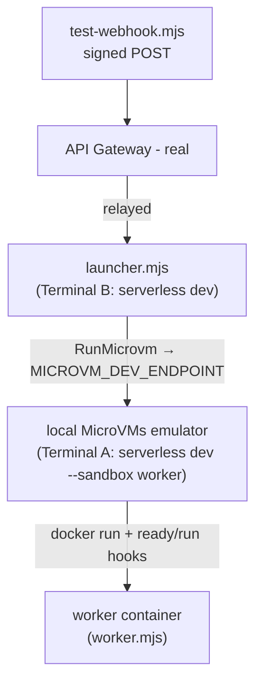
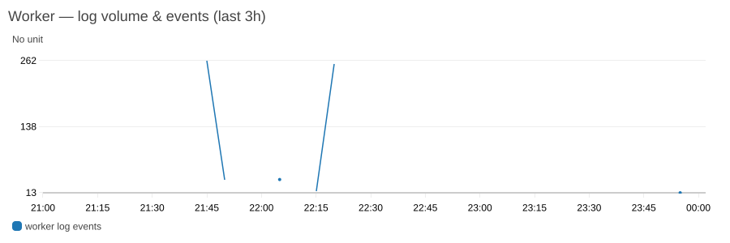
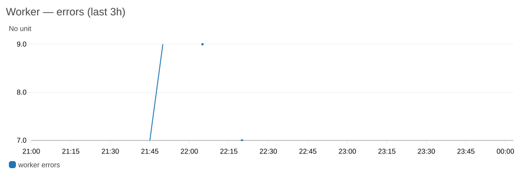

# Claude self-hosted sandboxes on AWS Lambda MicroVMs

Run each **Claude Managed Agent** session inside its own throwaway, isolated **AWS Lambda MicroVM** — a real Linux VM built from *your* `Dockerfile` — launched on demand by a webhook, and defined in a single `serverless.yml`.

You get one clean sandbox per session (no shared state between sessions), your organization's API key never touches AWS compute, and the **exact same worker code runs on your laptop in Docker during development and in a production MicroVM** — so the dev loop is fast and faithful.

> New to this? Two concepts, one sentence each:
> - **Claude Managed Agents** let you run Claude agents that use tools (bash, file edits, …). A *self-hosted* environment means **you** host the sandbox those tools run in, instead of Anthropic.
> - **AWS Lambda MicroVMs** are lightweight, fast-booting VMs (built from a container image) that AWS launches, suspends, and terminates for you — ideal for one-per-session isolation.
> Background: [AWS Lambda MicroVMs for Claude Managed Agents](https://docs.aws.amazon.com/lambda/latest/dg/microvms-integrations-claude-managed-agents.html).

---

## Contents

- [What you'll build](#what-youll-build)
- [Features this example showcases](#features-this-example-showcases)
- [Architecture](#architecture)
- [Prerequisites](#prerequisites)
- [Repository layout](#repository-layout)
- [Step 1 — One-time setup & deploy](#step-1--one-time-setup--deploy)
- [Step 2 — Develop locally (real webhook, local Docker)](#step-2--develop-locally-real-webhook-local-docker)
- [Step 3 — Go live with Claude (still on your laptop)](#step-3--go-live-with-claude-still-on-your-laptop)
- [Step 4 — Ship to production (same code)](#step-4--ship-to-production-same-code)
- [Step 5 — Observe (dashboard & logs)](#step-5--observe-dashboard--logs)
- [How it works (deep dive)](#how-it-works-deep-dive)
- [Configuration reference](#configuration-reference)
- [Production hardening](#production-hardening)
- [Troubleshooting](#troubleshooting)
- [Clean up](#clean-up)
- [Further reading](#further-reading)

---

## What you'll build

A tiny, complete **control plane** that turns a Claude webhook into an isolated sandbox:

> Anthropic sends a signed `session.status_run_started` webhook → an **API Gateway** endpoint → a **launcher** Lambda verifies the signature and calls `RunMicrovm` → one **MicroVM** boots your `worker/` image, claims that session, runs the agent's tool calls in `/workspace`, and exits.

Everything above is one `serverless.yml`. The Serverless Framework `sandboxes` feature builds and manages the worker MicroVM image (and its IAM roles, log group, and dashboard); you write the launcher and the worker.

---

## Features this example showcases

| Feature | Why it's useful |
| --- | --- |
| **One MicroVM per session** | Each session gets a fresh, isolated Linux VM. No cross-session state leakage; a crash or runaway in one session can't touch another. |
| **Local dev = production, byte-for-byte** | `serverless dev` runs the *same* worker image in a local Docker container, driven by the *real* webhook — no per-VM cloud cost, instant edit loop. |
| **Secret-by-reference security** | The launcher passes only a *reference* to the environment-key secret into the VM. The VM reads the key with its own IAM role. Your org API key never reaches AWS compute. |
| **Observability on by default** | Every deploy gets a CloudWatch **dashboard**, per-component log groups, and an error metric — no config required. |
| **Lifecycle hooks** | The worker is notified at `ready` (image build) and `run` (per session) via a simple HTTP contract. |
| **Non-root by default** | The worker runs as an unprivileged user; the agent's tools operate in `/workspace`. |

---

## Architecture

**Components and how a request flows:**



**One session, end to end:**



**How it maps to `serverless.yml`:**

| Architecture piece | In this repo |
| --- | --- |
| Launcher Lambda (verify signature, `RunMicrovm`) | `functions.launcher` → [`launcher/launcher.mjs`](launcher/launcher.mjs) |
| Per-session MicroVM + worker | `sandboxes.worker` → [`worker/`](worker/) (image built by the framework) |
| Image build role, S3 artifact, log group, dashboard | generated by the `sandboxes` feature |
| MicroVM execution role (reads the env key) | `sandboxes.worker.iam.executionRole` |
| Secrets (signing secret, env key) | `resources` → `SigningSecret`, `EnvironmentKeySecret` |
| `POST /webhook` | the launcher's `http` event |

**Security model — the org key never reaches AWS compute.** The launcher only ever passes `ENVIRONMENT_KEY_SECRET_ID` (a *reference*) into the MicroVM. The MicroVM's own execution role calls `secretsmanager:GetSecretValue` at runtime. The launcher itself only reads the *signing* secret (to verify webhooks).

---

## Prerequisites

**For deploy + local dev + the synthetic smoke test (no Anthropic account needed):**

- An **AWS account** with credentials configured (`aws sts get-caller-identity` should work).
- **Docker** running (the local dev emulator launches the worker as a container).
- **Node.js 22+** and the **Serverless Framework v4** (`npm i -g serverless`).
- **`jq`** (used to read values out of `serverless info --json`).

**Additionally, for a real Claude session (Step 3+):**

- Access to **Claude Managed Agents** with a **self-hosted** environment (Claude Console).
- The **`ant` CLI** (Anthropic's Claude Developer Platform CLI) to create sessions — install it per its docs, then authenticate:
  ```bash
  ant auth login          # or: export ANTHROPIC_API_KEY=sk-ant-...
  ant --version           # confirm it's on your PATH
  ```

---

## Repository layout

```
self-hosted-webhook/
├── serverless.yml        # the whole control plane: launcher fn + sandboxes.worker + secrets
├── launcher/
│   └── launcher.mjs      # verifies the webhook, calls RunMicrovm
├── worker/
│   ├── Dockerfile        # the MicroVM image (non-root node base)
│   ├── worker.mjs        # serves lifecycle hooks; claims + runs the session
│   └── package.json      # worker's runtime deps (AWS SDK, Anthropic SDK)
├── test-webhook.mjs      # sends a synthetic, correctly-signed webhook (no Anthropic account)
└── images/               # sanitized dashboard screenshots used in this README
```

---

## Step 1 — One-time setup & deploy

Even if you plan to develop locally, deploy once first: local Dev Mode works by **relaying the real deployed launcher** to your machine, so the API Gateway endpoint, secrets, and roles must exist.

```bash
npm install
serverless deploy
```

This builds the worker MicroVM image and creates the launcher, API Gateway, two secrets, IAM roles, **log groups, an error metric, and a CloudWatch dashboard**. You'll see:

```text
✔ Service deployed to stack sandboxes-self-hosted-webhook-dev (39s)
endpoint: POST - https://abc123xyz0.execute-api.us-east-1.amazonaws.com/dev/webhook

functions:
  launcher: sandboxes-self-hosted-webhook-dev-launcher
```

Note the outputs — you'll reuse `WebhookUrl`, `SigningSecretArn`, and `EnvironmentKeySecretArn`:

```bash
serverless info --verbose
```

```text
Stack Outputs:
  WebhookUrl: https://abc123xyz0.execute-api.us-east-1.amazonaws.com/dev/webhook
  SigningSecretArn: arn:aws:secretsmanager:us-east-1:111122223333:secret:SigningSecret-XXXX
  EnvironmentKeySecretArn: arn:aws:secretsmanager:us-east-1:111122223333:secret:EnvironmentKeySecret-XXXX
  WorkerImageIdentifier: arn:aws:lambda:us-east-1:111122223333:microvm-image:sandboxes-self-hosted-webhook-worker-dev
```

> **What got created?** Among the stack resources: `LauncherLambdaFunction`, `ApiGatewayRestApi` + `/webhook` method, `WorkerImage` (`AWS::Lambda::MicrovmImage`) + `WorkerImageBuildRole`, `WorkerExecutionRole`, `SigningSecret` + `EnvironmentKeySecret`, `WorkerLogGroup` + `LauncherLogGroup`, `WorkerErrorsMetricFilter`, and `SandboxesDashboard`.

---

## Step 2 — Develop locally (real webhook, local Docker)

Edit `launcher/launcher.mjs` **and** `worker/worker.mjs` on your machine and see changes immediately — while a **real, signed webhook** drives the flow. No real MicroVMs are launched, so there's no per-VM cost.



Two `serverless dev` sessions cooperate:
- **`serverless dev --sandbox worker`** — a local, SDK-compatible **AWS Lambda MicroVMs emulator** (`http://127.0.0.1:9100`), backed by a Docker container built from `worker/`.
- **`serverless dev`** — functions Dev Mode; relays the *deployed* launcher's invocations to your local `launcher.mjs`. You hit the real webhook URL; your local code runs.

### Prerequisites for this step

1. Docker running, and the stack deployed once (Step 1).
2. Store a webhook signing secret, and keep the value for the test script:
   ```bash
   SIGNING_ARN=$(serverless info --json | jq -r '.outputs[] | select(.OutputKey=="SigningSecretArn").OutputValue')
   export SIGNING_SECRET="whsec_$(openssl rand -base64 24)"
   # Storing a secret VALUE isn't something the framework manages, so use the AWS CLI here:
   aws secretsmanager put-secret-value --secret-id "$SIGNING_ARN" --secret-string "$SIGNING_SECRET"
   ```

### Terminal A — the worker (local emulator)

```bash
serverless dev --sandbox worker
```

```text
Dev ϟ Mode

Runs sandbox "worker" locally against an emulated AWS Lambda MicroVMs API — the same code runs in dev and production.

Identity   worker execution role (IAM emulation)
Region     us-east-1
Endpoint   http://127.0.0.1:9100   ← point your AWS SDK or CLI here
Source     worker   (watched — edits rebuild the image)

MicroVMs API ready — Ctrl-C to stop
```

> Runs the container as the worker's real execution role (IAM emulation), so it reads Secrets Manager exactly like production. Add `--no-assume-role` to use your ambient credentials.
> **Port 9100 already in use** (e.g. a leftover dev session)? Use `serverless dev --sandbox worker --port 9200` and set `MICROVM_DEV_ENDPOINT` to match below.

### Terminal B — the launcher (functions Dev Mode)

```bash
export MICROVM_DEV_ENDPOINT=http://127.0.0.1:9100   # point RunMicrovm at Terminal A
serverless dev
```

```text
Functions:
  launcher: sandboxes-self-hosted-webhook-dev-launcher
Endpoints:
  POST - https://abc123xyz0.execute-api.us-east-1.amazonaws.com/dev/webhook
✔ Connected (Ctrl+C to cancel)
```

### Terminal C — fire a signed webhook

```bash
export WEBHOOK_URL=$(serverless info --json | jq -r '.outputs[] | select(.OutputKey=="WebhookUrl").OutputValue')
WEBHOOK_URL="$WEBHOOK_URL" SIGNING_SECRET="$SIGNING_SECRET" node test-webhook.mjs
```

```text
POST https://abc123xyz0.execute-api.us-east-1.amazonaws.com/dev/webhook
  session id: sesn_test_XXXX
<- 200 {"microvm_id":"microvm-XXXX","session_id":"sesn_test_XXXX"}
```

Back in **Terminal A**, a real Docker container boots and handles the dispatch:

```text
→ RunMicrovm  microvm-XXXX  ·  http://127.0.0.1:51234  ·  terminates after 300s idle
─ microvm-XXXX  worker: hook server listening on 0.0.0.0:9000
─ microvm-XXXX  worker: ready hook received
─ microvm-XXXX  worker: run hook received
  hooks ready+run delivered  microvm-XXXX
─ microvm-XXXX  worker: looking for work item for session sesn_test_XXXX
─ microvm-XXXX  worker: no work item found for session sesn_test_XXXX
```

Because there's no real Claude session behind the *synthetic* webhook, the worker boots, finds no matching work, and exits cleanly — which is the point: this proves the **webhook → signature verify → `RunMicrovm` → worker dispatch** loop end to end, all on your laptop. Next step wires a real session so the worker actually *does* something.

An **unsigned** request is rejected before anything launches:

```bash
curl -i -X POST "$WEBHOOK_URL" -H 'content-type: application/json' \
  -d '{"type":"session.status_run_started","data":{"type":"session","id":"sesn_demo"}}'
# → HTTP/1.1 401  ...  signature verification failed
```

### It's a real container — inspect it with the Docker CLI

The emulator runs each launch as an ordinary Docker container (named `sls-sandbox-dev-<service>-<sandbox>-<id>`), so your usual Docker tools work. List them:

```bash
docker ps -a --filter name=sls-sandbox
```

```text
NAMES                                                          IMAGE                                                                STATUS
sls-sandbox-dev-...-worker-XXXX  serverless-sandbox-dev/sandboxes-self-hosted-webhook-worker:latest  Exited (0) 5 seconds ago
```

Read a container's output directly with `docker logs`:

```bash
docker logs sls-sandbox-dev-sandboxes-self-hosted-webhook-worker-XXXX
```

```text
worker: hook server listening on 0.0.0.0:9000
worker: ready hook received
worker: run hook received
worker: looking for work item for session sesn_XXXX
worker: no work item found for session sesn_XXXX
```

The emulator also streams these lines inline (prefixed `─ <id>`), but because it's a normal container you can also `docker logs`, `docker inspect`, or even `docker exec` into a still-running one — handy for deeper debugging.

### The edit loop

- Edit **`launcher/launcher.mjs`** → the next webhook runs your new code (no redeploy).
- Edit **`worker/worker.mjs` or `worker/Dockerfile`** → the emulator rebuilds the image; the next `RunMicrovm` launches a fresh container.
- When done: `Ctrl-C` both, then `serverless deploy` once to restore the deployed launcher (Dev Mode temporarily swaps it for a relay shim).

---

## Step 3 — Go live with Claude (still on your laptop)

Now make the worker do real work — a live Claude session running **in your local Docker container**.

1. **Create the agent and a self-hosted environment.** You can script the agent and environment with the `ant` CLI (the environment key and webhook still need the Console — see the next bullet):

   ```bash
   # An agent with the sandbox toolset (bash/file tools), and a self-hosted environment:
   ant beta:agents create --name "sandbox-agent" \
     --model '{"id":"claude-sonnet-5"}' --tool '{"type":"agent_toolset_20260401"}'
   ant beta:environments create --name "lambda-microvms" --config '{"type":"self_hosted"}'
   ```

   Note the **agent id** (`agent_…`) and **environment id** (`env_…`) from the output. (You can also do this in the Claude Console.)

2. **In the Claude Console**, open the environment and click **Generate environment key** (Console-only, even if you created the environment via the API). Then create a **webhook** for `session.status_run_started` events — this gives you the **signing secret** (`whsec_…`) — and set its endpoint to the stack's `WebhookUrl`. See [Self-hosted sandboxes](https://platform.claude.com/docs/en/managed-agents/self-hosted-sandboxes) and [Webhooks](https://platform.claude.com/docs/en/managed-agents/webhooks).

3. **Configure and deploy.** If Dev Mode from Step 2 is still running, stop it first — press `Ctrl-C` in Terminals A and B (Dev Mode swapped the deployed launcher for a relay shim, so deploy with it stopped). Store both secret values (the framework doesn't manage secret values, so use the AWS CLI):
   ```bash
   SIGNING_ARN=$(serverless info --json | jq -r '.outputs[] | select(.OutputKey=="SigningSecretArn").OutputValue')
   ENVKEY_ARN=$(serverless info --json | jq -r '.outputs[] | select(.OutputKey=="EnvironmentKeySecretArn").OutputValue')
   # The whsec_... from the webhook you created in the Console, and the environment key:
   aws secretsmanager put-secret-value --secret-id "$SIGNING_ARN" --secret-string '<whsec_... from the Console>'
   aws secretsmanager put-secret-value --secret-id "$ENVKEY_ARN" --secret-string '<environment key>'
   ```
   Set your environment id in `serverless.yml` (so the launcher polls the right environment), then deploy:
   ```yaml
   # serverless.yml → provider.environment
   ANTHROPIC_ENVIRONMENT_ID: env_XXXXXXXXXXXXXXXX
   ```
   ```bash
   serverless deploy
   ```
   > Leave `ANTHROPIC_ENVIRONMENT_ID` empty and the launcher rejects the launch with a clear error instead of starting a VM that can't find its environment.

4. **Start Dev Mode, then trigger a real session** — three terminals:
   ```bash
   # Terminal A — local MicroVMs emulator
   serverless dev --sandbox worker
   ```
   ```bash
   # Terminal B — launcher relay, pointed at Terminal A
   export MICROVM_DEV_ENDPOINT=http://127.0.0.1:9100
   serverless dev
   ```
   ```bash
   # Terminal C — create a session and start its run (this fires the webhook).
   # Use the agent + environment ids from step 1.
   SID=$(ant beta:sessions create \
     --agent agent_XXXX --environment-id env_XXXXXXXXXXXXXXXX --format json | jq -r .id)
   ant beta:sessions:events send --session-id "$SID" \
     --event '{"type":"user.message","content":[{"type":"text",
       "text":"Create /workspace/hello.txt containing \"hi from the sandbox\". Then you are done."}]}'
   ```

Creating the session and sending the message starts the run → fires the webhook → your **local** launcher → your **local** emulator → a Docker container that now claims the session and runs it. In **Terminal A** you'll see the full agent loop complete:

```text
─ microvm-XXXX  worker: run hook received
─ microvm-XXXX  worker: handling session sesn_XXXX (work sesn_XXXX)
─ microvm-XXXX  worker: session sesn_XXXX complete
```

Confirm what the agent actually did:

```bash
ant beta:sessions:events list --session-id "$SID"
```

The full output is JSON; abbreviated, a successful run shows the agent's thinking, tool calls, and final message:

```text
event types: session.status_running, user.message, agent.thinking,
             agent.tool_use, user.tool_result, agent.message, session.status_idle

agent.tool_use  write  {"file_path":"/workspace/hello.txt","content":"hi from the sandbox"}
agent.tool_use  bash   {"command":"cat /workspace/hello.txt"}
agent.message   "The file has been created at /workspace/hello.txt containing
                 \"hi from the sandbox\". Task complete."
```

Claude just ran tools inside a sandbox on your machine. Same code, no cloud MicroVM cost.

> **Just want a smoke test without an Anthropic account?** The synthetic `test-webhook.mjs` from Step 2 works against the deployed stack too — it exercises the launch path, just not the agent loop.

---

## Step 4 — Ship to production (same code)

There's nothing new to write — the code you ran locally is what runs in the cloud. Stop Dev Mode if it's running (`Ctrl-C` in Terminals A and B) and redeploy to restore the real launcher, then trigger a session (no Dev Mode this time) — the webhook drives the *deployed* launcher, which launches a **real MicroVM**:

```bash
serverless deploy   # restores the real launcher (Dev Mode leaves a relay shim in place)

# Same trigger as Step 3, using your agent + environment ids:
SID=$(ant beta:sessions create \
  --agent agent_XXXX --environment-id env_XXXXXXXXXXXXXXXX --format json | jq -r .id)
ant beta:sessions:events send --session-id "$SID" \
  --event '{"type":"user.message","content":[{"type":"text",
    "text":"Create /workspace/hello.txt containing \"hi from the sandbox\". Then you are done."}]}'
```

Watch it from the AWS side:

```bash
WORKER_IMAGE=$(serverless info --json | jq -r '.outputs[] | select(.OutputKey=="WorkerImageIdentifier").OutputValue')

# No serverless command lists running MicroVM instances, so use the AWS CLI:
aws lambda-microvms list-microvms --image-identifier "$WORKER_IMAGE" \
  --query 'items[].[microvmId,state]' --output table
```

```text
--------------------------------------------
|  microvm-XXXX  |  RUNNING                 |
--------------------------------------------
```

A MicroVM moves `RUNNING → TERMINATED` when the worker finishes and its process exits (the container stopping terminates the VM directly):

```bash
aws lambda-microvms get-microvm --microvm-identifier microvm-XXXX \
  --query '{state:state,reason:stateReason}' --output json
# { "state": "TERMINATED", "reason": "Container Stopped with Exit Code: 0" }
```

---

## Step 5 — Observe (dashboard & logs)

Observability is **on by default** — no config needed. Every deploy creates a CloudWatch dashboard (one per service), per-component log groups, and an error metric.

`serverless deploy` prints the dashboard's console URL in its summary — just open it:

```text
dashboard: https://us-east-1.console.aws.amazon.com/cloudwatch/home?region=us-east-1#dashboards/dashboard/sandboxes-self-hosted-webhook-dev-sandboxes
```

It shows worker log volume/events, an error count, MicroVM launches, and recent log lines. For example, log-event volume spiking as sessions run:





Read logs from the CLI — both image-build lines and runtime lines from MicroVM instances (defaults to the last 10 minutes; widen with `--startTime`):

```bash
serverless logs --sandbox worker --startTime 30m
```

```text
worker: run hook received
worker: looking for work item for session sesn_XXXX
worker: handling session sesn_XXXX (work sesn_XXXX)
worker: session sesn_XXXX complete
```

---

## How it works (deep dive)

- **Lifecycle hooks.** The worker runs an HTTP server on port 9000 and answers `POST /aws/lambda-microvms/runtime/v1/<hook>`. This example enables `ready` (image-build snapshot gate) and `run` (per-instance dispatch). Hooks are **opt-in**: state transitions happen regardless, but your code is only *notified* for hooks you declare. Respond `200` quickly — the `run` timeout defaults to ~2s — then do work asynchronously.
- **"Idle" means no inbound endpoint traffic — not "no code running."** A MicroVM is suspended/terminated after `maxIdleDurationSeconds` with no requests to its endpoint, *even if it's busy*. This worker is a poller (all outbound), so it isn't kept alive by activity — it finishes by **exiting**, which terminates the VM immediately. The idle policy is just the backstop for a hung worker.
- **No idempotency here.** Anthropic may deliver a webhook more than once; each delivery launches a MicroVM. One claims the session; the others find no work and exit. Fine for an example — see [Production hardening](#production-hardening).
- **`MICROVM_DEV_ENDPOINT`, not `AWS_ENDPOINT_URL_LAMBDA_MICROVMS`.** The standard AWS override is honored by *every* MicroVMs client in the process — including the framework's own deploy-time calls (Dev Mode spawns a deploy). A launcher-specific var, read only by `launcher.mjs`, avoids redirecting those to the emulator; it's unset in production, so it's a no-op there.

---

## Configuration reference

The whole control plane is [`serverless.yml`](serverless.yml). The key block:

```yaml
sandboxes:
  worker:
    artifact: ./worker          # directory with a Dockerfile → built into a MicroVM image
    minimumMemory: 2048         # MiB
    hooks:
      ready: true               # build-time snapshot gate (worker answers on :9000)
      run: true                 # runtime hook delivering the per-session dispatch
    iam:
      executionRole:            # the VM's own role — reads the env key at runtime
        statements:
          - Effect: Allow
            Action: secretsmanager:GetSecretValue
            Resource: !Ref EnvironmentKeySecret
    # observability is ON by default (dashboard + log group + error metric).
    # To customize retention or add alarms, add an `observability:` block; to opt out: observability: false
```

The launcher's IAM (in `provider.iam`) grants `lambda:RunMicroVm`, `iam:PassRole` (the execution role), `lambda:PassNetworkConnector` (for the auto-attached `HTTP_INGRESS`/`INTERNET_EGRESS` connectors), and `secretsmanager:GetSecretValue` on the signing secret.

---

## Production hardening

Intentionally omitted here to keep the example focused on the webhook → launch flow. For production, add:

- **AWS WAF** in front of the webhook (managed rule sets + per-IP rate limiting).
- **Idempotency** — dedupe deliveries (e.g. a DynamoDB-backed idempotency table keyed on the event id); Anthropic retries the same event on any non-2xx and can deliver concurrently.
- **Rate limiting** toward `RunMicrovm` (the API has a launch TPS limit).
- **A longer, explicit idle policy / max lifetime** tuned to your longest expected session.

---

## Troubleshooting

| Symptom | Cause & fix |
| --- | --- |
| Worker logs `404 NotFoundError` from the poller | Empty `ANTHROPIC_ENVIRONMENT_ID` → the worker polls an empty environment. Set it in `serverless.yml` (`provider.environment`) and redeploy. (The launcher fails fast on an empty value.) |
| `Port 9100 is already in use` | A leftover `serverless dev --sandbox` session. Use `--port 9200` and set `MICROVM_DEV_ENDPOINT` to match. |
| Deploy fails: `... did not stabilize` | Occasionally transient on first image create. Re-run `serverless deploy`. |
| Worker logs "no Anthropic environment key is stored yet" | Expected for the synthetic test — populate `EnvironmentKeySecret` for real sessions (Step 3). |
| Webhook returns `401` | Signature mismatch — the stored `SigningSecret` must equal the value you sign with (and the one registered in the Console). |
| Several MicroVMs per session | No-idempotency (see [above](#production-hardening)); one claims the work, the rest exit. |

---

## Clean up

```bash
serverless remove
```

> Terminate any running MicroVM instances first — active instances reference the `WorkerImage` and can block deletion.

---

## Further reading

- [AWS Lambda MicroVMs for Claude Managed Agents](https://docs.aws.amazon.com/lambda/latest/dg/microvms-integrations-claude-managed-agents.html)
- Serverless Framework `sandboxes` guide (hooks, observability, IAM, `dev`/`invoke`/`logs`)
- [Standard Webhooks](https://www.standardwebhooks.com/) — the signature scheme the launcher verifies
